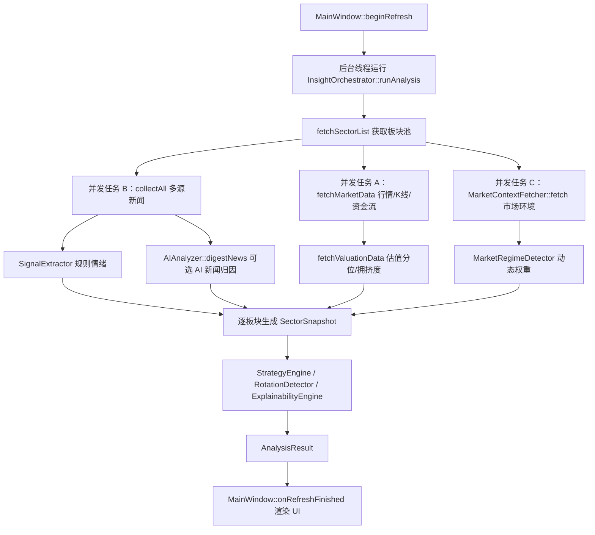

# InvestInsight Codex 项目上下文

最后更新：2026-06-16

## 用途

这是给后续 Codex 处理本仓库前阅读的项目地图。开始改代码前先读本文件，再按需要查看具体源码。凡是修改了产品定位、数据源、分析流水线、评分因子、UI 主流程或验证命令，都要同步更新本文档和 `docs/product/InvestInsight-product-overview.md`。

## 技术栈

- 桌面应用：Qt Widgets。
- 语言：C++17。
- 构建：CMake。
- 网络：Qt Network + 自定义 `HttpClient`。
- 并发：`QtConcurrent`、`QFutureWatcher`、`QTimer`。
- 本地配置/缓存：`QSettings("InvestInsight", "InvestInsight")`。

常用验证命令：

```powershell
cmake --build build --config Release -- /m
.\build\Release\InvestInsight.exe --dump-sector-changes
powershell -NoProfile -ExecutionPolicy Bypass -File .\tools\verify_ui_smoke.ps1
powershell -NoProfile -ExecutionPolicy Bypass -File .\package_windows.ps1
```

第二个命令用于核对板块今日涨幅口径，当前重点输出有色金属、半导体、锂电池。
第三个命令用于 UI 重构 smoke 验证，会构建 Release 主程序和 `InvestInsightUiSmoke`，并检查主题、Widget 样式、HTML 基础 CSS、图表渲染，以及主窗口关键 Tab/按钮是否存在。

提交约定：后续本地 commit 尽量控制在 200 到 300 行，原则上不超过 500 行；每次提交前必须完成匹配的构建或功能验证；Codex 不直接 push 远端。

## 重要文件地图

| 文件 | 责任 |
| --- | --- |
| `src/main.cpp` | 应用入口；支持 GUI 启动、`--auto-analyze`、`--dump-sector-changes` 和 `--ui-smoke` 诊断命令。 |
| `src/ui/AppTheme.cpp` | UI 主题颜色、Widget 样式、HTML 基础 CSS 和系统暗色模式检测。 |
| `src/ui/renderers/ChartRenderer.cpp` | 板块详情趋势图、K 线、成交量、MACD、资金流和周/月参考图的独立渲染器。 |
| `src/ui/renderers/DashboardRenderer.cpp` | 总览工作台 HTML 渲染器，覆盖市场仪表盘、关键机会、持仓摘要和 AI 摘要。 |
| `src/ui/renderers/SectorTableRenderer.cpp` | 板块机会 HTML 渲染器，覆盖板块/指数混合列表、筛选、排序和数据审计摘要。 |
| `src/ui/renderers/StrategyRenderer.cpp` | 策略跟踪 HTML 渲染器，覆盖市场操作建议、Top 板块、持仓诊断和未来事件日历。 |
| `src/ui/renderers/SectorDetailRenderer.cpp` | 板块详情 HTML 渲染器，覆盖投资结论、图表、技术指标、资金流、回测、新闻证据和数据质量。 |
| `src/ui/MainWindow.cpp` | Qt 主界面；配置页、主页面、刷新进度、结果渲染、板块详情、持仓相关 UI。 |
| `src/core/InsightOrchestrator.cpp` | 核心编排器；并发拉取行情/新闻/市场环境，聚合评分，生成最终 `AnalysisResult`。 |
| `src/core/SectorFetcher.cpp` | 板块列表、行情、K 线、今日涨幅、资金流、估值分位、拥挤度。 |
| `src/providers/RealFinanceNewsProvider.cpp` | 多源新闻抓取、关键词归因、新闻质量评分、去重。 |
| `src/core/SignalExtractor.cpp` | 规则新闻情绪识别。 |
| `src/core/AIAnalyzer.cpp` | 可选 AI 分析；新闻归因 Stage 1 和重点板块深度研判 Stage 2。 |
| `src/core/MarketContext.cpp` | 指数、A 股涨跌家数、板块资金流合计、市场风险分。 |
| `src/core/MarketRegimeDetector.cpp` | 市场状态识别和动态因子权重。 |
| `src/core/StrategyEngine.cpp` | 生成短中长期观点、止盈止损和操作建议文本。 |
| `src/domain/AnalysisResult.h` | UI 使用的核心结果结构，尤其是 `SectorSnapshot`。 |
| `package_windows.ps1` | Windows 1.0 发布打包脚本；生成根目录 `InvestInsight-Windows` 和 zip。 |
| `package_macos.sh` | macOS 1.0 发布打包脚本；在 macOS 上生成根目录 `.app` 和 zip。 |
| `assets/` | 应用图标源、Windows `.ico`、macOS `.icns`、Qt qrc 图标资源。 |
| `tools/generate_app_icons.py` | 图标资源生成脚本，需要 Pillow。 |
| `tools/verify_ui_smoke.ps1` | UI 重构 smoke 验证脚本；构建主程序和 UI smoke 测试程序。 |
| `tests/ui/AppThemeSmoke.cpp` | UI smoke 测试入口，覆盖 `AppTheme` 并调度图表渲染、总览页渲染 smoke 测试。 |
| `tests/ui/ChartRendererSmoke.cpp` | 图表渲染 smoke 测试，使用合成板块 K 线校验图表非空、尺寸稳定并绘制出非背景像素。 |
| `tests/ui/DashboardRendererSmoke.cpp` | 总览页 HTML smoke 测试，校验主题 CSS、市场仪表盘、关键机会、板块名称和 AI 摘要。 |
| `tests/ui/SectorTableRendererSmoke.cpp` | 板块机会 HTML smoke 测试，校验主题 CSS、筛选、排序、板块跳转和指数跳转。 |
| `tests/ui/StrategyRendererSmoke.cpp` | 策略跟踪 HTML smoke 测试，校验市场建议、Top 板块、指数参考、持仓诊断和未来事件。 |
| `tests/ui/SectorDetailRendererSmoke.cpp` | 板块详情 HTML smoke 测试，校验图表嵌入和决策页关键量化信息。 |
| `docs/release/PACKAGING.md` | Windows/macOS 打包和使用说明。 |
| `docs/design/InvestInsight-ui-redesign-mockup.md` | UI 优化设计稿说明；包含当前界面截图、总览/事件雷达/板块机会/策略跟踪/AI 助手/配置/板块详情长图和后续实现映射。 |
| `docs/superpowers/plans/2026-06-20-ui-refactor-phase0-plan.md` | UI 重构 Phase 0 执行计划，记录小切片提交边界和验证命令。 |

## 当前主流程



## 核心数据口径

板块“今日涨幅”：

- 最高优先级：同花顺实时分时接口。
- K 线用途：图表、历史序列和缺失时兜底。
- 不能在已有有效实时涨幅时，用日 K 线最后一根 bar 覆盖 `changePct`。
- 修改相关逻辑后必须运行 `--dump-sector-changes`，并核对有色金属、半导体、锂电池。

板块池：

- 新浪概念板块、行业板块和东方财富 push2 多源合并。
- `kEssentialSectors` 是兜底清单，保证核心板块不因接口波动消失。
- 当前板块分类仍依赖静态关键词和接口返回，需要后续持续维护。

新闻：

- `RealFinanceNewsProvider` 并发拉取多源新闻。
- `buildInfluenceMap` 是关键词到板块的主要静态映射。
- `inferIndustries` 只在当前板块池中匹配，避免输出不存在的板块。
- 新闻质量 = 时间新鲜度 × 来源可信度。

预测：

- `forecastScore` 由动量、今日涨跌、新闻情绪、新闻密度、资金流、热度、均值回归、技术面、估值和拥挤度组合而成。
- 数据质量权重和多源一致性权重会压缩低可信度结果。
- `MarketRegimeDetector` 会按市场状态调整部分因子权重。
- `AdviceAction` 当前阈值为：大于等于 `0.22` 增配，小于等于 `-0.22` 减配，其余持有。
- 趋势生命周期解释链会修正过热、派发、下跌等状态下的过度乐观动作。

## AI 配置

AI Provider 配置保存在本地 `QSettings`，不要写入仓库。当前 `AIAnalyzer` 支持 OpenAI-compatible、Anthropic Claude 和 Gemini OpenAI 兼容形式。AI 关闭或调用失败时，系统仍使用规则引擎完成分析。

AI 两个阶段：

- Stage 1：对新闻标题做板块归因和情绪/影响强度识别。
- Stage 2：对 Top N 板块做深度分析，并把 AI 理由追加到策略说明中。

## UI 状态

`MainWindow` 当前以手动刷新为主。`m_progressPollTimer` 用于轮询后台分析进度；`m_autoRefreshTimer` 在头文件中存在，但当前没有形成完整的后台常驻刷新产品能力。后续如果实现定时刷新、系统托盘或提醒，需要同步更新产品说明。

当前 UI 代码仍主要集中在 `src/ui/MainWindow.cpp`，但主题颜色、Widget 样式、HTML 基础 CSS 和暗色模式检测已拆到 `src/ui/AppTheme.cpp`，板块详情图表渲染已拆到 `src/ui/renderers/ChartRenderer.cpp`，`MainWindow::buildDataDashboardHtml` 已委托 `src/ui/renderers/DashboardRenderer.cpp`，`MainWindow::buildSectorTableHtml` 已委托 `src/ui/renderers/SectorTableRenderer.cpp`，`MainWindow::buildStrategyHtml` 已委托 `src/ui/renderers/StrategyRenderer.cpp`，板块详情页 HTML 结构已开始沉淀到 `src/ui/renderers/SectorDetailRenderer.cpp`。主导航文案已先调整为“总览工作台 / 总览 / 板块机会 / 策略跟踪 / AI 助手 / 配置中心”。后续事件雷达、板块详情重排和主导航优化应参考 `docs/design/InvestInsight-ui-redesign-mockup.md`。该设计稿建议把主界面组织为左侧导航、顶部状态条、关键事件雷达、板块机会与风险、风险与失效条件、事件传导路径和板块详情首屏布局，并额外提供策略跟踪、AI 助手、配置页和板块详情长图。实现时优先把大段 HTML 渲染拆到 renderer/panel 文件。

板块详情页重构时不要删减当前已有量化信息。新的详情长图要求保留投资信号、短中长期收益、核心评分、技术指标、阶段收益/回测、资金流、相关板块、新闻证据和数据质量。

## 打包与图标

1.0 版本的发布脚本放在项目根目录：

- Windows：`powershell -NoProfile -ExecutionPolicy Bypass -File .\package_windows.ps1`
- macOS：`chmod +x ./package_macos.sh && ./package_macos.sh`

Windows 脚本默认使用 `build-package-windows` 独立构建目录，并通过 `INVESTINSIGHT_WIN32_SUBSYSTEM=ON` 生成正式 GUI 子系统程序；常规开发构建 `build` 默认不启用该选项，以保留 `--dump-sector-changes` 的控制台诊断体验。

图标资源已接入三层：

- `assets/app.qrc` + `QApplication::setWindowIcon`：运行时窗口和任务栏图标。
- `assets/windows/app-icon.rc` + `assets/windows/app-icon.ico`：Windows exe 图标。
- `assets/macos/app-icon.icns` + CMake bundle 属性：macOS Dock/Finder 图标。

打包产物 `InvestInsight-Windows*`、`InvestInsight-macOS*` 和 zip 已加入 `.gitignore`，不要提交生成包。

## 修改建议

处理问题时优先定位到所属层：

- 行情数值不准：先看 `SectorFetcher.cpp`，再用 `--dump-sector-changes` 验证。
- 新闻不及时或误归因：先看 `RealFinanceNewsProvider.cpp` 和 `SignalExtractor.cpp`。
- 推荐动作不合理：先看 `InsightOrchestrator.cpp` 的因子、阈值和权重，再看 `StrategyEngine.cpp`。
- 市场环境影响异常：看 `MarketContext.cpp` 和 `MarketRegimeDetector.cpp`。
- UI 展示或交互问题：看 `MainWindow.cpp`。

避免只改 UI 文案来掩盖数据问题。涉及投资建议时，优先保留可解释字段，让用户知道建议来自新闻、行情、资金、技术面还是 AI。

## 后续产品重点

当前最值得推进的方向：

- 后台增量新闻扫描和提醒，减少信号滞后。
- 新闻驱动类型识别，让系统自动判断短线催化、中期趋势或长期配置。
- 板块池、同义词和上下游关系的定期更新。
- 对每次建议进行事后跟踪，形成命中率和滞后性评估。
- 将“买入/卖出”类表达升级为“观察、短线机会、趋势跟踪、长期配置、过热谨慎、回避/减配”。
