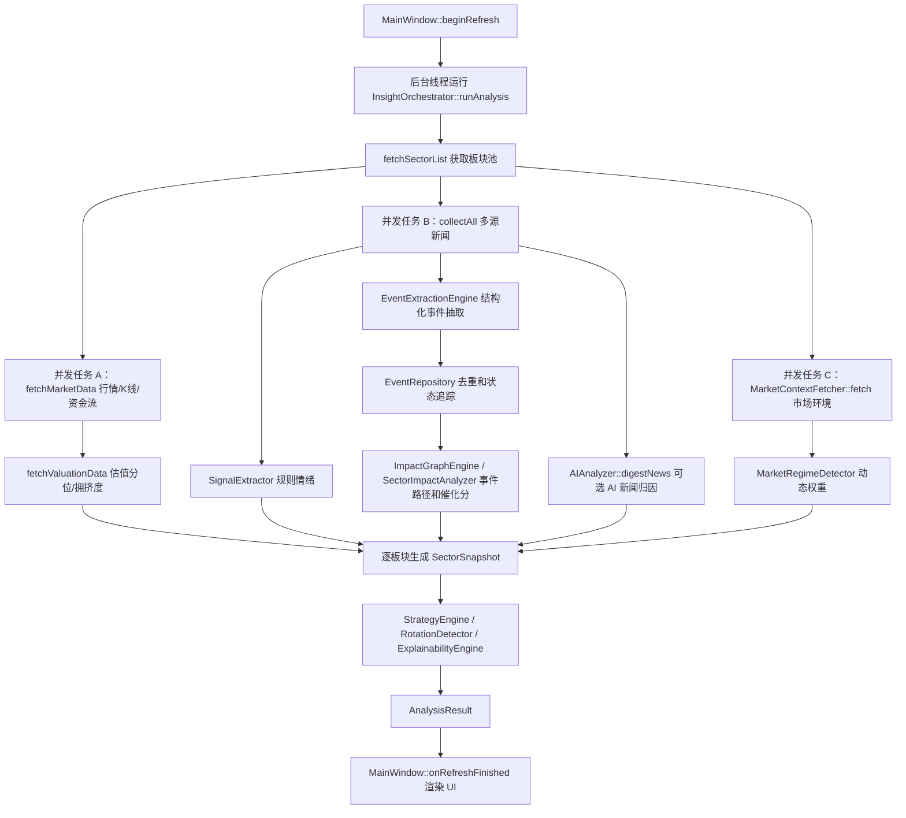

# InvestInsight Codex 项目上下文

最后更新：2026-06-23

## 用途

这是给后续 Codex 处理本仓库前阅读的项目地图。开始改代码前先读 `docs/README.md`、本文件和 `docs/product/InvestInsight-product-overview.md`，再按需要查看具体源码。凡是修改了产品定位、数据源、分析流水线、评分因子、UI 主流程、打包发布或验证命令，都要同步更新相关文档。

## 技术栈

- 桌面应用：Qt Widgets。
- 语言：C++17。
- 构建：CMake。
- 网络：Qt Network + 自定义 `HttpClient`。
- 并发：`QtConcurrent`、`QFutureWatcher`、`QTimer`。
- 本地配置/缓存：`QSettings("InvestInsight", "InvestInsight")`。

常用验证命令：

```powershell
cmake --build build --config Release -- /m
.\build\Release\InvestInsight.exe --dump-sector-changes
powershell -NoProfile -ExecutionPolicy Bypass -File .\tools\verify_ui_smoke.ps1
.\build\Release\InvestInsightEventSmoke.exe
.\build\Release\InvestInsightAIAnalyzerSmoke.exe
.\build\Release\InvestInsight.exe --debug-event-impact "美联储降息预期升温，市场关注下次 FOMC 会议"
.\build\Release\InvestInsight.exe --dump-event-rules
powershell -NoProfile -ExecutionPolicy Bypass -File .\package_windows.ps1
chmod +x ./package_macos.sh && ./package_macos.sh
```

第二个命令用于核对板块今日涨幅口径，当前重点输出有色金属、半导体、锂电池。
第三个命令用于 UI 重构 smoke 验证，会构建 Release 主程序和 `InvestInsightUiSmoke`，并检查主题、Widget 样式、HTML 基础 CSS、图表渲染，以及主窗口关键 Tab/按钮是否存在。
涉及 UI 或用户可见内容显示改动时，还需要通过自动化入口、调试参数或测试接口跳转到目标页面，等待渲染完成后截图确认，并在交付说明或提交说明中记录截图路径或验证结论。
第四个命令用于事件传导引擎 smoke 验证，当前覆盖事件类型、事件状态、地区、观察节点、影响路径、事件仓库和证据保留。
第五个命令用于 AI 协同分析 smoke 验证，当前覆盖结构化可读字段 JSON 解析和异常兜底。
第六个命令用于单条文本的事件影响诊断，会输出 `type/state/region/checkpoint`、时间字段、证据可信度、影响周期和评分因子。
第七个命令用于列出事件抽取规则清单，便于核对规则 key、类型、地区、置信度和关键词。

提交约定：后续本地 commit 尽量控制在 200 到 300 行，原则上不超过 500 行；每次提交前必须完成匹配的构建或功能验证；Codex 不直接 push 远端。

文档组织约定：`docs/README.md` 是总入口；版本相关的设计稿、规格、实施计划和截图素材统一放在 `docs/versions/vX.Y/` 下，文件名使用稳定主题名，不再用日期作为文件名主键。跨版本长期有效的项目地图、产品说明保留在 `docs/codex/` 和 `docs/product/`。

## 重要文件地图

| 文件 | 责任 |
| --- | --- |
| `src/main.cpp` | 应用入口；支持 GUI 启动、`--auto-analyze`、`--dump-sector-changes`、`--debug-event-impact`、`--dump-event-rules` 和 `--ui-smoke` 诊断命令。 |
| `src/ui/AppTheme.cpp` | UI 主题颜色、Widget 样式、HTML 基础 CSS 和系统暗色模式检测。 |
| `src/ui/renderers/ChartRenderer.cpp` | 板块详情趋势图、K 线、成交量、MACD、资金流和周/月参考图的独立渲染器。 |
| `src/ui/renderers/DashboardRenderer.cpp` | 总览工作台 HTML 渲染器，覆盖市场仪表盘、关键事件雷达、板块机会与风险、下一观察点和 AI 摘要。 |
| `src/ui/renderers/SectorTableRenderer.cpp` | 板块机会 HTML 渲染器，覆盖板块/指数混合列表、筛选、排序、事件催化、风险提示和数据审计摘要。 |
| `src/ui/renderers/StrategyRenderer.cpp` | 策略跟踪 HTML 渲染器，覆盖跟踪状态卡片、市场操作建议、Top 板块、持仓诊断和未来事件日历。 |
| `src/ui/renderers/SectorDetailRenderer.cpp` | 板块详情 HTML 渲染器，覆盖投资结论、核心评分、信号解释、事件驱动、影响路径、图表、阶段收益、资金流、回测、新闻证据和数据质量。 |
| `src/ui/renderers/IndexDetailRenderer.cpp` | 指数详情 HTML 渲染器，覆盖指数方向、趋势图表、技术指标、市场风控和数据质量。 |
| `src/ui/renderers/EventRadarRenderer.cpp` | 事件雷达 HTML 渲染器，覆盖结构化事件、事件催化分、传导路径、市场风险和失效条件。 |
| `src/ui/MainWindow.cpp` | Qt 主界面；配置页、主页面、刷新进度、AI 助手、结果渲染、板块详情、持仓相关 UI。 |
| `src/core/InsightOrchestrator.cpp` | 核心编排器；并发拉取行情/新闻/市场环境，聚合评分，生成最终 `AnalysisResult`。 |
| `src/core/SectorFetcher.cpp` | 板块列表、行情、K 线、今日涨幅、资金流、估值分位、拥挤度。 |
| `src/providers/RealFinanceNewsProvider.cpp` | 多源新闻抓取、关键词归因、新闻质量评分、去重。 |
| `src/core/SignalExtractor.cpp` | 规则新闻情绪识别。 |
| `src/domain/MacroEvent.h` | 宏观/政策事件领域结构，定义事件类型、状态、地区、时间字段、观察点、证据和影响周期。 |
| `src/core/EventRuleBook.cpp` | 事件抽取规则库，识别货币政策、通胀就业、商品供需和产业政策等事件。 |
| `src/core/EventExtractionEngine.cpp` | 从新闻标题/摘要抽取结构化 `MacroEvent`，保留来源、发布时间、检测时间和证据可信度。 |
| `src/core/ImpactGraphEngine.cpp` | 事件影响路径规则库，把宏观事件映射到直接/间接影响板块和解释路径。 |
| `src/core/SectorImpactAnalyzer.cpp` | 聚合事件路径结果，生成板块级 `eventCatalystScore` 原始分。 |
| `src/core/EventRepository.cpp` | 本地 JSON 事件追踪仓库，记录事件首次发现、最近出现、出现次数、状态变化和受影响板块的事后窗口表现。 |
| `src/core/AIAnalyzer.cpp` | 可选 AI 分析；新闻归因 Stage 1、重点板块深度研判 Stage 2，以及 v2.2 AI 协同可读字段解析。 |
| `src/core/MarketContext.cpp` | 指数、A 股涨跌家数、板块资金流合计、市场风险分。 |
| `src/core/MarketRegimeDetector.cpp` | 市场状态识别和动态因子权重。 |
| `src/core/StrategyEngine.cpp` | 生成短中长期观点、止盈止损和操作建议文本。 |
| `src/domain/AnalysisResult.h` | UI 使用的核心结果结构，尤其是 `SectorSnapshot`。 |
| `run_gui.sh` / `run_gui.bat` | 本地启动脚本；Windows 启动 `build/Release/InvestInsight.exe`，macOS 优先启动 `build/InvestInsight.app/Contents/MacOS/InvestInsight`。 |
| `package_windows.ps1` | Windows 1.0 发布打包脚本；生成根目录 `InvestInsight-Windows` 和 zip，支持指定构建目录、toolchain、跳过构建和跳过 zip。 |
| `package_macos.sh` | macOS 1.0 发布打包脚本；在 macOS 上生成根目录 `.app` 和 zip，支持指定构建目录、toolchain、跳过构建和跳过 zip。 |
| `assets/` | 应用图标源、Windows `.ico`、macOS `.icns`、Qt qrc 图标资源。 |
| `tools/generate_app_icons.py` | 图标资源生成脚本，需要 Pillow。 |
| `tools/verify_ui_smoke.ps1` | UI 重构 smoke 验证脚本；构建主程序和 UI smoke 测试程序。 |
| `tests/ui/AppThemeSmoke.cpp` | UI smoke 测试入口，覆盖 `AppTheme` 并调度图表渲染、总览页渲染 smoke 测试。 |
| `tests/ui/ChartRendererSmoke.cpp` | 图表渲染 smoke 测试，使用合成板块 K 线校验图表非空、尺寸稳定并绘制出非背景像素。 |
| `tests/ui/DashboardRendererSmoke.cpp` | 总览页 HTML smoke 测试，校验工作台 CSS、关键事件雷达、板块机会与风险和下一观察点。 |
| `tests/ui/SectorTableRendererSmoke.cpp` | 板块机会 HTML smoke 测试，校验事件催化、风险提示、筛选、排序、板块跳转和指数跳转。 |
| `tests/ui/StrategyRendererSmoke.cpp` | 策略跟踪 HTML smoke 测试，校验跟踪状态、市场建议、Top 板块、指数参考、持仓诊断和未来事件。 |
| `tests/ui/SectorDetailRendererSmoke.cpp` | 板块详情 HTML smoke 测试，校验首屏核心评分、信号解释、影响路径、阶段收益、资金流关系、图表嵌入和决策页关键量化信息。 |
| `tests/ui/IndexDetailRendererSmoke.cpp` | 指数详情 HTML smoke 测试，校验图表嵌入、技术指标、市场风控和数据质量。 |
| `tests/ui/EventRadarRendererSmoke.cpp` | 事件雷达 HTML smoke 测试，校验事件队列、传导路径、风险区块和未来催化展示。 |
| `tests/core/EventImpactSmoke.cpp` | 事件传导引擎 smoke 测试，校验事件模型字段、事件抽取、状态识别、证据保留、路径映射和仓库追踪。 |
| `tests/core/AIAnalyzerSmoke.cpp` | AI 协同分析 smoke 测试，校验固定 JSON 样本可解析、无效 JSON 可兜底。 |
| `docs/README.md` | 文档总入口，说明按职责和版本查看文档的路径。 |
| `docs/versions/v1.0/release/PACKAGING.md` | 1.0 Windows/macOS 打包和使用说明。 |
| `docs/versions/v2.0/design/ui-workbench-redesign.md` | 2.0 UI 工作台设计稿说明；包含当前界面截图、总览/事件雷达/板块机会/策略跟踪/AI 助手/配置/板块详情长图和后续实现映射。 |
| `docs/versions/v2.0/specs/event-impact-engine-design.md` | 2.0 事件传导引擎规格说明。 |
| `docs/versions/v2.0/plans/ui-refactor-phase0-plan.md` | 2.0 UI 重构 Phase 0 执行计划，记录小切片提交边界和验证命令。 |
| `docs/versions/v2.0/plans/event-impact-engine-phase1-5-plan.md` | 2.0 事件传导引擎 Phase 1-5 执行计划，记录事件抽取、路径规则、评分接入、UI 展示、事件追踪和诊断命令的分段提交门禁。 |
| `docs/versions/v2.1/plans/event-impact-engine-completion-plan.md` | 2.1 事件传导引擎补完计划，记录事件模型、状态时间、路径规则、评分、追踪和 UI 的剩余实现切片。 |
| `docs/versions/v2.2/plans/ui-content-readability-optimization-plan.md` | 2.2 UI 内容可读性优化计划，记录 AI 协同分析、事件证据链、理由去重、板块机会表格、板块详情趋势图和截图验证要求。 |

## 当前主流程



## 核心数据口径

板块“今日涨幅”：

- 最高优先级：同花顺实时分时接口。
- K 线用途：图表、历史序列和缺失时兜底。
- 不能在已有有效实时涨幅时，用日 K 线最后一根 bar 覆盖 `changePct`。
- 修改相关逻辑后必须运行 `--dump-sector-changes`，并核对有色金属、半导体、锂电池。

板块池：

- 新浪概念板块、行业板块和东方财富 push2 多源合并。
- `kEssentialSectors` 是兜底清单，保证核心板块不因接口波动消失。
- 当前板块分类仍依赖静态关键词和接口返回，需要后续持续维护。

新闻：

- `RealFinanceNewsProvider` 并发拉取多源新闻。
- `buildInfluenceMap` 是关键词到板块的主要静态映射。
- `inferIndustries` 只在当前板块池中匹配，避免输出不存在的板块。
- 新闻质量 = 时间新鲜度 × 来源可信度。
- Phase 1-5.1 已新增 `EventExtractionEngine`、`EventRuleBook`、`ImpactGraphEngine`、`SectorImpactAnalyzer` 和 `EventRepository`，可把新闻标题/摘要抽取为结构化宏观事件，记录事件首次发现与状态变化，生成事件到板块的直接/间接影响路径，并把 `eventImpacts`、`eventCatalystScore` 和 `eventSummary` 注入 `SectorSnapshot`。
- v2.1 切片 1 已补齐事件模型表达能力：新增财政政策、地缘贸易、金融市场制度类型，新增传闻、已发生、失效状态，新增事件时间字段、结构化观察点、证据 URL/可信度、事件新鲜度/重要性和影响周期。新状态和新类型的抽取规则仍在 v2.1 后续切片中推进。
- v2.1 切片 2 已接入基础状态和观察点解析：传闻、已发生、失效可由关键词识别，FOMC、CPI、PCE、非农、LPR、MLF 等模板观察点会写入 `MacroEvent::nextCheckpoints`，事件仓库可跨重启还原新增状态。
- v2.1 切片 3 已扩展高频事件抽取：美联储鹰派/加息、国内财政刺激/专项债、半导体出口限制、原油供给扰动和市场制度规则可被结构化为对应 `MacroEventType`。
- v2.1 切片 4 已补齐第一批高频事件影响路径：美联储鹰派/加息会映射到半导体、黄金、创新药压力，财政稳增长映射到建筑建材、地产、证券，半导体出口限制、原油供给扰动和市场制度优化也会带有方向、关系、条件和影响周期。
- v2.1 切片 5 已升级事件催化评分：`SectorEventImpact` 会携带来源可信度、新鲜度权重、时间衰减和最新证据时间，`SectorImpactAnalyzer` 公开 `scoreImpact` 并按 `direction * strength * confidence * stateWeight * sourceReliability * noveltyWeight * timeDecay` 计算贡献。
- v2.1 切片 6 已扩展事件仓库追踪：`TrackedEventRecord` 可保存 `TrackedImpactPerformance`，记录板块、窗口天数、窗口收益和捕获时间，用于后续命中率与滞后性校准。
- v2.1 切片 7 已补齐 UI 展示：事件雷达新增结构化事件时间线，展示状态、地区、观察点和证据可信度；事件路径和板块详情会展示影响周期、来源可信度和失效条件。
- v2.1 切片 8 已补齐诊断命令：`--debug-event-impact` 输出事件时间字段、观察点、证据可信度、周期和评分因子；`--dump-event-rules` 输出规则 key、类型、地区、置信度和关键词。

预测：

- `forecastScore` 由动量、今日涨跌、新闻情绪、新闻密度、资金流、热度、均值回归、技术面、估值、拥挤度和轻量事件催化分组合而成。
- `eventCatalystScore` 来自结构化宏观/政策事件的影响路径，并已按来源可信度、新鲜度和证据时间衰减压缩；它只以小幅 `eventCatalystFactor` 纳入 `forecastScore`，避免未确认事件直接强推买入。
- 数据质量权重和多源一致性权重会压缩低可信度结果。
- `MarketRegimeDetector` 会按市场状态调整部分因子权重。
- `AdviceAction` 当前阈值为：大于等于 `0.22` 增配，小于等于 `-0.22` 减配，其余持有。
- 趋势生命周期解释链会修正过热、派发、下跌等状态下的过度乐观动作。

## AI 配置

AI Provider 配置保存在本地 `QSettings`，不要写入仓库。当前 `AIAnalyzer` 支持 OpenAI-compatible、Anthropic Claude 和 Gemini OpenAI 兼容形式。AI 关闭或调用失败时，系统仍使用规则引擎完成分析。

AI 两个阶段：

- Stage 1：对新闻标题做板块归因和情绪/影响强度识别。
- Stage 2：对 Top N 板块做深度分析，并把 AI 理由、可读标题、摘要、影响路径、首要理由/风险、下一观察点和规则分歧说明写入独立展示字段。

v2.2 已开始把 AI 从“补充理由”扩展为协同分析层：`AIReadableInsight` 会保存可读标题、摘要、影响路径、理由/风险去重和规则分歧提示；AI 不直接覆盖 `forecastScore`、`eventCatalystScore` 或最终建议动作。AI 输出需要结构化 JSON，失败或关闭时继续使用规则引擎结果。

## UI 状态

`MainWindow` 当前以手动刷新为主。`m_progressPollTimer` 用于轮询后台分析进度；`m_autoRefreshTimer` 在头文件中存在，但当前没有形成完整的后台常驻刷新产品能力。后续如果实现定时刷新、系统托盘或提醒，需要同步更新产品说明。

当前 UI 代码仍主要集中在 `src/ui/MainWindow.cpp`，但主界面已经按 `docs/versions/v2.0/design/ui-workbench-redesign.md` 落地为左侧导航 + 顶部状态条 + 内容工作区：左侧入口包含“总览、事件雷达、板块机会、策略跟踪、AI 助手、配置”，顶部只显示当前页面标题、说明和运行状态，不再放置 AI 助手/配置快捷按钮或外层页签。“开始分析”和 AI 开关已经移动到总览页的分析控制卡片中，配置页作为左侧“配置”导航对应的右侧完整页面嵌入工作台。主题颜色、Widget 样式、HTML 基础 CSS 和暗色模式检测已拆到 `src/ui/AppTheme.cpp`，并新增 `sideNav`、`topStatusBar`、`workspace-shell`、`metric-grid`、`configCard`、`chatContextPanel` 等工作台样式。板块详情图表渲染已拆到 `src/ui/renderers/ChartRenderer.cpp`，`MainWindow::buildDataDashboardHtml` 已委托 `src/ui/renderers/DashboardRenderer.cpp`，`MainWindow::buildEventRadarHtml` 已委托 `src/ui/renderers/EventRadarRenderer.cpp`，`MainWindow::buildSectorTableHtml` 已委托 `src/ui/renderers/SectorTableRenderer.cpp`，`MainWindow::buildStrategyHtml` 已委托 `src/ui/renderers/StrategyRenderer.cpp`，`MainWindow::buildSectorHtml` 已委托 `src/ui/renderers/SectorDetailRenderer.cpp`，`MainWindow::buildIndexHtml` 已委托 `src/ui/renderers/IndexDetailRenderer.cpp`。

总览页已改为工作台式信息结构，包含分析控制、关键事件雷达、板块机会与风险和下一观察点；板块机会页在完整模式下新增事件催化列和风险提示列；策略跟踪页新增“跟踪状态”指标卡片；AI 助手已改为左侧当前上下文 + 快捷问题、右侧对话的布局；配置页取消独立欢迎页和内部主配置 Tab，改为 AI 接入、我的持仓、后台刷新与提醒、数据源健康同屏展示；事件雷达已新增结构化事件时间线，板块详情页在投资结论之后新增“核心评分”“信号解释”“影响路径”“阶段收益与回测”“资金流与相关板块”等分区，并继续保留事件驱动、趋势图表、技术指标、资金流、回测、新闻证据和数据质量。后续 UI 优化优先继续收敛 renderer/panel 文件，避免把大段 HTML 塞回主窗口。

板块详情页重构时不要删减当前已有量化信息。新的详情长图要求保留投资信号、短中长期收益、核心评分、技术指标、阶段收益/回测、资金流、相关板块、新闻证据和数据质量。

## 打包与图标

1.0 版本的发布脚本放在项目根目录：

- Windows：`powershell -NoProfile -ExecutionPolicy Bypass -File .\package_windows.ps1`
- macOS：`chmod +x ./package_macos.sh && ./package_macos.sh`

Windows 脚本默认使用 `build-package-windows` 独立构建目录，并通过 `INVESTINSIGHT_WIN32_SUBSYSTEM=ON` 生成正式 GUI 子系统程序；常规开发构建 `build` 默认不启用该选项，以保留 `--dump-sector-changes` 的控制台诊断体验。
macOS 脚本默认使用 `build-macos` 独立构建目录，支持 `--build-dir`、`--configuration`、`--toolchain-file`、`--skip-build` 和 `--no-zip`，并会优先从已有 `build/CMakeCache.txt` 继承 `CMAKE_TOOLCHAIN_FILE`。本地 `run_gui.sh` 在 macOS 上构建 `build` 后应启动 `.app` 内的新二进制，避免误跑旧的 `build/InvestInsight`。

图标资源已接入三层：

- `assets/app.qrc` + `QApplication::setWindowIcon`：运行时窗口和任务栏图标。
- `assets/windows/app-icon.rc` + `assets/windows/app-icon.ico`：Windows exe 图标。
- `assets/macos/app-icon.icns` + CMake bundle 属性：macOS Dock/Finder 图标。

打包产物 `InvestInsight-Windows*`、`InvestInsight-macOS*` 和 zip 已加入 `.gitignore`，不要提交生成包。
打包脚本、启动脚本、CMake bundle/部署参数或应用图标变更时，必须同步更新 `docs/versions/v1.0/release/PACKAGING.md` 或对应版本的发布说明。

## 修改建议

处理问题时优先定位到所属层：

- 行情数值不准：先看 `SectorFetcher.cpp`，再用 `--dump-sector-changes` 验证。
- 新闻不及时或误归因：先看 `RealFinanceNewsProvider.cpp` 和 `SignalExtractor.cpp`。
- 推荐动作不合理：先看 `InsightOrchestrator.cpp` 的因子、阈值和权重，再看 `StrategyEngine.cpp`。
- 市场环境影响异常：看 `MarketContext.cpp` 和 `MarketRegimeDetector.cpp`。
- UI 展示或交互问题：看 `MainWindow.cpp`。

避免只改 UI 文案来掩盖数据问题。涉及投资建议时，优先保留可解释字段，让用户知道建议来自新闻、行情、资金、技术面还是 AI。

## 后续产品重点

当前最值得推进的方向：

- 后台增量新闻扫描和提醒，减少信号滞后。
- 新闻驱动类型识别，让系统自动判断短线催化、中期趋势或长期配置。
- 板块池、同义词和上下游关系的定期更新。
- 对每次建议进行事后跟踪，形成命中率和滞后性评估。
- 将“买入/卖出”类表达升级为“观察、短线机会、趋势跟踪、长期配置、过热谨慎、回避/减配”。
