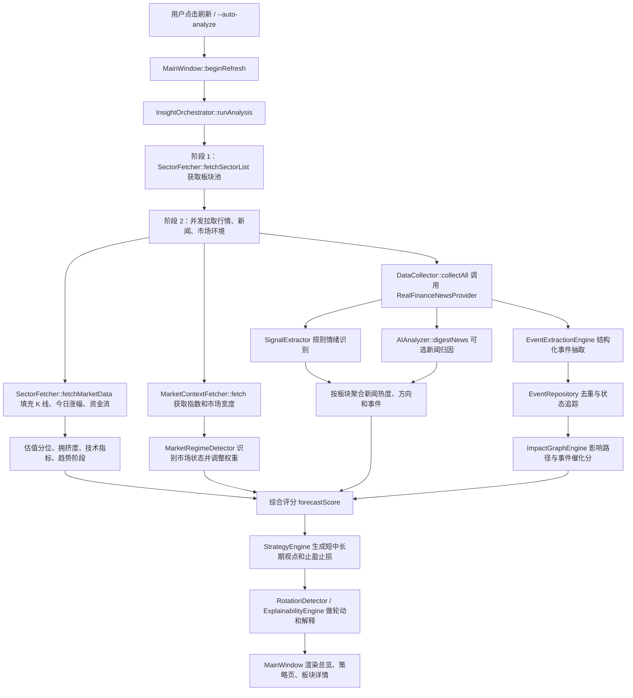
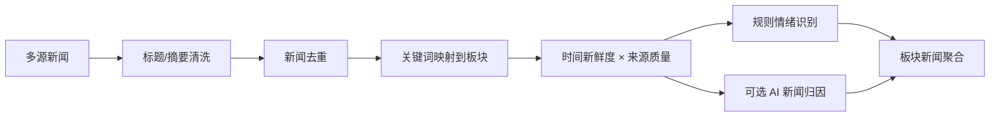
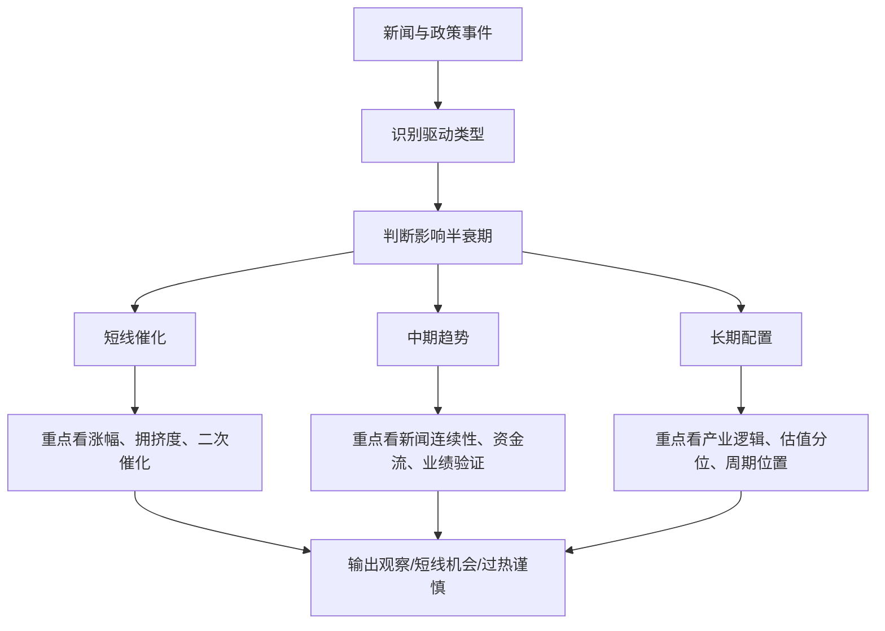

# InvestInsight 产品说明

最后更新：2026-06-22

## 一句话定位

InvestInsight 是一个面向 A 股行业/概念板块的“新闻信息收集 + 行情验证 + 趋势预测”桌面工具。它的目标不是直接替代投顾，而是把新闻、板块行情、资金流、技术面和 AI 研判组织成可解释信号，帮助用户判断某些板块是否值得短期关注、继续观察、长期跟踪或降低仓位。

## 产品价值

当前产品最重要的价值是自动识别新闻对板块的影响，并结合行情确认信号是否已经被市场消化。用户不需要手动追踪大量财经新闻、板块涨幅和技术指标，系统会把分散信息压缩成板块级别的趋势判断、风险提示和操作建议。

“短期”和“长期”目前不应被硬编码为固定天数。更合适的定义是由新闻驱动类型决定：事件催化通常偏短，产业趋势和政策周期偏中长期，周期资源类则需要结合商品价格、库存、利率和供需变化判断持续性。

## 当前产品形态

当前代码实现的是 Qt/C++17 桌面应用，主入口为 `src/main.cpp`，主要界面在 `src/ui/MainWindow.cpp`。用户打开后直接进入工作台，可通过左侧“配置”进入 AI Provider、Key 和持仓设置，也可以关闭 AI，仅使用规则引擎。在“总览”的分析控制卡片中点击“开始分析”后，系统开始拉取数据、展示进度，并在完成后渲染数据仪表盘、事件雷达、板块列表、策略页和单板块详情页。

当前主界面已经向 2.0 设计稿落地：整体采用左侧导航、顶部状态条和内容工作区，左侧入口包含“总览、事件雷达、板块机会、策略跟踪、AI 助手、配置”。顶部状态条只展示当前页面标题、说明和运行状态，不再保留 AI 助手/配置快捷按钮，也不再显示右侧页签条；“开始分析”和 AI 开关位于总览页的分析控制卡片中。总览页已经委托独立 `DashboardRenderer`，事件雷达页已经委托独立 `EventRadarRenderer`，板块机会页已经委托独立 `SectorTableRenderer`，策略跟踪页已经委托独立 `StrategyRenderer`，板块详情页已经委托独立 `SectorDetailRenderer`，指数详情页已经委托独立 `IndexDetailRenderer`。事件雷达已展示结构化事件时间线、事件状态、观察点、证据可信度、事件催化分和传导路径；总览页已突出分析控制、关键事件雷达、板块机会与风险和下一观察点；板块机会页新增事件催化和风险提示；策略页新增跟踪状态卡片；AI 助手已改为当前上下文 + 快捷问题 + 对话区；配置页已嵌入工作台，并同屏展示 AI 接入、我的持仓、后台刷新与提醒、数据源健康；板块详情页已新增“核心评分”“信号解释”“事件驱动”“影响路径”“阶段收益与回测”“资金流与相关板块”等区块，事件驱动与影响路径会显示影响周期、来源可信度和失效条件，便于查看事件如何影响该板块。

1.0 版本已经补齐软件发布形态：项目包含 Windows/macOS 打包脚本，并配置了统一的应用图标。图标以新闻卡片、板块柱状行情、上行洞察线和信号弧为核心元素，表达“新闻驱动的行业洞察与预测”。

UI 设计稿保存在 `docs/versions/v2.0/design/ui-workbench-redesign.md`。当前已完成第一轮投研工作台化改造：左侧导航、顶部状态条、关键事件雷达、板块机会与风险、策略跟踪状态、AI 助手上下文栏、配置页工作台卡片和板块详情长页核心分区已接入。配置页已经纳入左侧导航壳层，后续可继续进一步拆分 `MainWindow.cpp` 的页面构建逻辑。

板块详情页是产品的关键决策页，视觉优化不能只保留事件解释。当前详情页已按“投资结论 -> 核心评分 -> 信号解释 -> 短中长期观点 -> 事件驱动 -> 影响路径 -> 图表和数据证据”的顺序组织，并继续展示技术指标、阶段收益/回测、资金流、新闻证据和数据质量，让用户既能看懂原因，也能核对原始数据。

产品已经具备以下能力：

- 多源板块行情、K 线、资金流和估值/拥挤度分析。
- 多源财经新闻抓取、关键词映射、新闻情绪和影响板块识别。
- 规则事件抽取和路径解释雏形，可识别货币政策、通胀就业、商品供需和产业政策事件，并解释直接/间接影响板块；当前处在 core smoke 阶段，尚未正式接入主分析评分。
- 可选 AI 两阶段分析：先做新闻影响归因，再对重点板块做深度研判。
- 市场环境识别，包括指数、涨跌家数、资金流和风险偏好状态。
- 板块趋势、技术指标、轮动、过热、资金结构和解释链分析。
- 个人持仓相关提示，按用户持有板块生成更贴近仓位的建议。

## 当前处理流程



## 板块行情逻辑

板块列表由 `SectorFetcher::fetchSectorList` 负责，当前采用多源合并：

- 新浪概念板块 `newFLJK`。
- 新浪行业板块 `newSinaHy`。
- 东方财富 `push2` 板块接口。
- 核心板块硬编码兜底，避免网络或接口波动导致常用板块消失。

板块详情由 `SectorFetcher::fetchMarketData` 填充，当前优先级如下：

1. 同花顺实时分时用于板块“今日涨幅”，这是当前最重要口径。
2. 同花顺板块 K 线用于图表和历史序列。
3. 腾讯 ETF 代理、东方财富板块 K 线、新浪 ETF 代理作为 K 线回退。
4. 新浪 MoneyFlow 提供板块资金流，并用 `QSettings` 缓存历史资金流。
5. K 线历史价格分位估算估值分位，成交量/换手/动量估算拥挤度。

近期修正过一个重要问题：同花顺日 K 接口在盘中可能返回与软件端实时涨幅不一致的当日收盘值，因此今日涨幅必须优先采用同花顺实时分时结果。当前诊断命令为：

```powershell
.\build\Release\InvestInsight.exe --dump-sector-changes
```

该命令会重点输出有色金属、半导体、锂电池的 `changePct`、数据来源、K 线来源和最新日期。

事件传导诊断命令为：

```powershell
.\build\Release\InvestInsight.exe --debug-event-impact "美联储降息预期升温，市场关注下次 FOMC 会议"
```

该命令会输出事件类型、状态、地区、观察节点，以及黄金、有色金属、半导体、创新药、证券等板块的方向、关系和传导路径。

## 新闻处理逻辑

新闻源集中在 `src/providers/RealFinanceNewsProvider.cpp`。当前并发拉取 12 路来源，包括东方财富、新浪、同花顺、华尔街见闻、网易、Google News 主流外媒 RSS、官方/政策源、财联社、证券时报、中国证券网等。

新闻进入系统后会经过四步：

1. 去重：按标题、来源、URL 和板块维度过滤重复新闻。
2. 归因：`buildInfluenceMap` 维护关键词到板块的静态映射，`inferIndustries` 用标题和摘要匹配当前板块池。
3. 质量评分：新闻时间越新权重越高，官方源、财联社、东方财富等源有不同可信度系数。
4. 情绪识别：`SignalExtractor` 用正负关键词给出方向和强度；启用 AI 时，`AIAnalyzer::digestNews` 会进一步输出板块、方向、影响强度和关键事件。

事件传导引擎 Phase 1-5.1 已新增 `MacroEvent`、`EventRuleBook`、`EventExtractionEngine`、`EventRepository`、`ImpactGraphEngine` 和 `SectorImpactAnalyzer`，能够把“美联储降息预期升温”“美联储将召开议息会议”“宣布降息”“CPI 高于预期导致预期修正”等文本结构化为事件类型、状态、地区、观察节点和证据，记录事件首次发现、最近出现、出现次数、状态变化和受影响板块的事后窗口表现，并把美联储降息预期映射到黄金、有色金属、半导体、创新药和证券等板块。事件影响已经接入 `SectorSnapshot`，但只以小幅 `eventCatalystFactor` 影响 `forecastScore`，避免未发生事件直接强推买入。

v2.1 已开始补齐事件模型和状态层：当前代码已经能表达财政政策、地缘贸易、金融市场制度，传闻、已发生、失效状态，结构化观察点、事件时间字段、证据 URL/可信度和影响周期。传闻、已发生、失效的基础关键词解析已接入，FOMC、CPI、PCE、非农、LPR、MLF 等模板观察点会写入事件对象；财政政策、地缘贸易、金融市场制度等新增类型的完整抽取规则仍会按 v2.1 后续切片继续实现。
高频事件抽取已进一步覆盖美联储鹰派/加息、财政刺激/专项债、半导体出口限制、原油供给扰动和市场制度事件；第一批影响路径已能映射到半导体、黄金、创新药、建筑建材、地产、证券、石油石化和交通运输等板块，并带有方向、关系、条件和影响周期。事件催化分已纳入来源可信度、新鲜度/重复度和证据时间衰减；事件仓库已能持久化事后窗口表现；事件雷达和板块详情已展示状态、观察点、证据可信度、影响周期和失效条件。



## 预测与推荐逻辑

核心评分在 `InsightOrchestrator::runAnalysis` 内完成。每个板块会生成 `SectorSnapshot`，其中 `forecastScore` 是综合预测分。当前主要因子包括：

- 5 日和 20 日动量。
- 今日涨跌幅。
- 新闻情绪、正负新闻比例和新闻密度。
- 资金流信号。
- 板块热度。
- 均值回归惩罚。
- 技术指标分数，包括 MACD、RSI、KDJ、均线、BOLL 和成交量。
- 估值分位和拥挤度。
- 数据质量权重和多源一致性权重。
- 市场状态动态权重，例如牛市、熊市、风险偏好上升、轮动行情等。
- 结构化事件催化分，但单次影响被限制在较小范围，更多用于提醒和解释。

动作阈值当前比较克制：

- `forecastScore >= 0.22`：增配。
- `forecastScore <= -0.22`：减配。
- 其他：持有/观望。

之后趋势生命周期系统会再做一次校正。例如进入过热、派发预警或下跌回避状态时，会把过于激进的增配建议降为持有或减配。

## 新闻驱动模型建议

下一阶段产品应把“短期/长期”做成系统自动识别，而不是让用户手动选择。建议引入新闻驱动类型：

| 驱动类型 | 典型信号 | 适合解释 |
| --- | --- | --- |
| 事件催化型 | 订单、政策发布、制裁、业绩超预期、突发供给扰动 | 偏短线，关注是否已经大涨和是否有二次催化 |
| 产业趋势型 | 国产替代、AI 算力、先进封装、创新药周期、机器人渗透率 | 偏中长期，关注持续新闻密度、业绩验证和回调机会 |
| 周期反转型 | 商品价格、库存、产能、利率、需求拐点 | 偏中期，关注价格和供需数据是否持续 |
| 政策驱动型 | 财政、货币、产业政策、监管放松或收紧 | 时长取决于政策落地强度和资金扩散速度 |
| 风险释放型 | 利空落地、估值修复、负面预期缓解 | 偏阶段性修复，需要风险确认 |
| 过热扩散型 | 新闻密集、涨幅过大、拥挤度高、资金短线涌入 | 重点不是买入，而是提醒追高风险 |



示例：

- 半导体更常见的是“产业趋势型 + 政策/技术催化”。应重点观察国产替代、AI 算力、先进封装、存储涨价、海外限制和龙头订单。
- 有色金属更常见的是“周期反转型 + 商品价格驱动”。应重点观察铜、铝、锂、黄金等价格、美元和利率、库存、供给扰动、全球需求。

## 当前问题和待优化点

1. 新闻速度和时效性仍是最大问题。基金买入存在成交延迟，如果系统在板块已经连续上涨 2 到 3 天后才提示买入，用户实际得到的是滞后信号。需要引入后台监控、盘中增量新闻、事件首次出现时间和信号衰减。
2. 板块分类目前主要依赖静态关键词和当前接口返回板块池。它可用但不够自更新，后续需要自动维护板块卡池、同义词、上下游映射和概念变更。
3. 当前刷新以用户手动触发为主，代码里有进度轮询定时器，但产品还没有完整的后台常驻监控、定时刷新和提醒机制。
4. 新闻归因仍可能把宏观新闻粗略映射到多个板块，需要引入影响路径解释，例如“降息 -> 地产/证券/银行”。
5. 推荐动作需要从“买/卖”升级为“观察、短线机会、趋势跟踪、长期配置、过热谨慎、回避/减配”，降低误导性。
6. 需要记录每次信号后的实际表现，用回测和命中率校准新闻源、AI 判断和评分权重。
7. UI 代码集中在 `MainWindow.cpp`，后续需要拆出主题、页面构建、HTML renderer、图表、持仓和 AI 助手模块，避免事件雷达和长期逻辑继续堆进主窗口文件。

## 推荐的产品演进

下一阶段优先级建议：

1. 做“信号新鲜度”：记录新闻首次出现、首次匹配板块、首次触发建议的时间差。
2. 做“后台增量扫描”：用户可选择关注板块或全市场板块，系统定时刷新并提醒。
3. 做“驱动类型识别”：把新闻事件分为事件催化、产业趋势、周期反转等，再决定短期/长期表达。
4. 做“板块池维护”：定期更新同花顺/东方财富/新浪板块名、代码、同义词和上下游关系。
5. 做“预测追踪”：每条建议生成后自动跟踪 1 日、3 日、5 日、20 日表现，用实际结果反向优化模型。
6. 做“UI 重构与事件工作台”：按设计稿拆分 `MainWindow`，新增事件雷达、传导路径和板块详情首屏结构。

UI 重构先按 Phase 0 小切片推进，优先拆出主题样式、图表渲染和 HTML renderer，再逐步接入事件雷达与板块详情重排；每个切片验证通过后只提交到本地仓库。
界面重构期间新增固定 smoke 验证流程：`tools/verify_ui_smoke.ps1` 会构建 Release 主程序和 UI smoke 测试程序，先确保主题、Widget 样式、HTML 基础 CSS、图表渲染、总览页 HTML 渲染、事件雷达 HTML 渲染、板块机会 HTML 渲染、策略页 HTML 渲染、板块详情 HTML 渲染、指数详情 HTML 渲染和主窗口关键入口没有被破坏，再进入下一片改动。

## 1.0 发布方式

当前发布脚本：

- Windows：`package_windows.ps1`，生成根目录 `InvestInsight-Windows` 和 `InvestInsight-Windows.zip`。
- macOS：`package_macos.sh`，在 macOS 上生成根目录 `InvestInsight-macOS.app` 和 `InvestInsight-macOS.zip`，并支持与 Windows 打包脚本对应的构建目录、配置、toolchain、跳过构建和跳过 zip 选项。

本地开发启动脚本也需要保持平台一致：Windows 通过 `run_gui.bat` 间接启动 Release exe，macOS 通过 `run_gui.sh` 构建后优先启动 `.app/Contents/MacOS/InvestInsight`，避免跑到旧的根目录二进制。

详细使用说明见 `docs/versions/v1.0/release/PACKAGING.md`。
