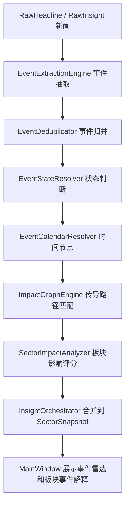
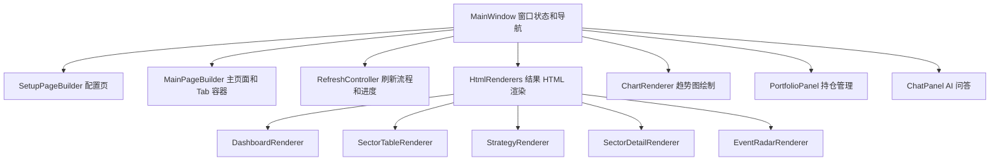
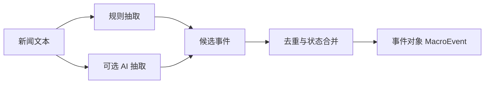
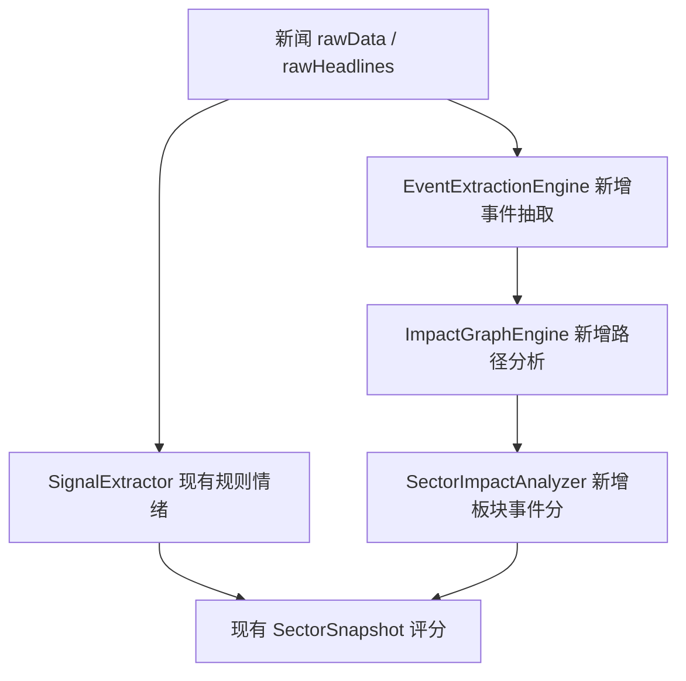

# 宏观/政策事件传导引擎开发规格

最后更新：2026-06-20

## 目标

将 InvestInsight 从“新闻关键词匹配板块”升级为“识别事件、判断事件状态、解释影响路径、再映射到板块”的分析系统。第一期重点解决宏观/政策事件对板块的直接和间接影响，尤其是美联储加息/降息、国内货币政策、财政政策、产业政策、商品价格和地缘/贸易限制这类新闻。

这不是直接做长线投资系统，但它是长线能力的地基。只有先理解事件如何传导，后续才能判断一个板块的长期逻辑是否增强、削弱或被证伪。

## 当前问题

当前系统的大致路径是：

```text
多源新闻 -> 标题/摘要清洗 -> 关键词匹配板块 -> 情绪强弱 -> 叠加行情/资金/技术面 -> 输出板块评分
```

这个路径适合发现短线热度，但有几个明显缺口：

1. 新闻没有被结构化为“事件”。系统知道标题里有“降息”，但不知道这是“预期”、 “议息会议安排”、 “已经发生”还是“官员表态”。
2. 事件没有时间轴。比如美联储降息可能还没发生，真正关键时间是下次 FOMC、CPI、PCE、非农等数据节点。
3. 事件影响没有路径。比如“美国降息”不是直接利好某个板块，而是通过美元、美债收益率、全球流动性、商品价格、风险偏好传导。
4. 间接影响缺失。比如美债收益率下降可能影响成长股估值，美元走弱可能影响有色/黄金，人民币压力变化又影响外资和出口链。
5. 短线和长线没有分层。当前 `forecastScore` 更像短中期综合分，无法表达“短期过热但长期逻辑增强”这种情况。

此外，当前 UI 层已经成为后续扩展的主要阻力：

1. `src/ui/MainWindow.cpp` 当前约 4300+ 行，职责过多。
2. 同一个文件同时负责窗口状态、刷新流程、配置页、主页面、HTML 拼接、图表绘制、持仓管理、AI 聊天和主题样式。
3. `buildDataDashboardHtml`、`buildSectorTableHtml`、`buildStrategyHtml`、`buildSectorHtml`、`buildIndexHtml` 等函数都在 `MainWindow` 内部，事件雷达和长期逻辑页面如果继续写进去，会让文件继续膨胀。
4. 当前 UI 更像“结果堆叠页”，对 2.0 需要的事件解释、影响路径、时间节点和长期逻辑分层展示不够友好。

## 设计原则

- 事件优先于新闻：新闻只是事件证据，不是最终分析对象。
- 状态优先于情绪：先判断“预期/待发生/已发生/落空”，再判断利好利空。
- 路径优先于结论：给出“为什么影响这个板块”，而不是只给板块名。
- 分层评分：短线交易、事件催化、中期趋势、长期逻辑分开。
- 可解释和可回放：每次判断都保存证据、来源、时间、路径和置信度。
- 保守表达：宏观事件通常有分情景影响，不能简单写成绝对利好/利空。
- UI 先重构再扩展：事件雷达、长期逻辑、影响路径等新视图不能继续塞进 `MainWindow.cpp`。
- 渐进式拆分：不重写整个 Qt UI，不换框架；先把纯渲染和页面构建从 `MainWindow` 中抽出来。
- 研究工具气质：界面应偏专业、紧凑、可扫描，而不是营销页或大卡片堆叠。

## 非目标

第一期不做这些事情：

- 不直接生成买卖指令。
- 不承诺预测宏观数据结果。
- 不做完整量化回测平台。
- 不做复杂知识图谱数据库。
- 不替代 AI 深度研究报告，只做事件结构化和影响路径。

## 方案选择

### 方案 A：继续扩展关键词表

做法：在 `RealFinanceNewsProvider::buildInfluenceMap` 中继续补更多宏观关键词和板块映射。

优点：实现最快，改动小。

缺点：仍然无法区分事件状态、发生时间和传导路径。会继续把“降息预期”“降息落地”“降息不及预期”混成同一类新闻。

### 方案 B：新增事件传导引擎

做法：在现有新闻流程之后新增一层事件抽取和影响分析。新闻先归并成 `MacroEvent`，再通过 `ImpactPath` 映射到 `SectorImpact`。

优点：能解释未发生事件、时间节点、直接/间接影响和情景差异，适合作为 2.0 地基。

缺点：需要新增数据结构、规则库、UI 展示和评分接入。

### 方案 C：完全依赖 AI 做事件分析

做法：把所有新闻和板块列表交给 AI，让 AI 直接输出宏观事件和影响板块。

优点：语义理解强，初期效果可能更像“研究员”。

缺点：稳定性、成本、可回放和可测试性较弱。AI 输出不适合作为唯一可信数据源。

推荐采用方案 B，AI 只作为事件抽取和路径补充，不作为唯一决策引擎。

### UI 重构方案选择

#### 方案 U-A：继续在 `MainWindow.cpp` 中增加新页面

优点：短期最快，不需要拆文件。

缺点：会让 `MainWindow.cpp` 继续膨胀，事件雷达、长期逻辑、影响路径图加入后维护成本会快速上升。这个方案不推荐。

#### 方案 U-B：轻量拆分 HTML 渲染器和页面构建器

做法：保留现有 `MainWindow` 作为窗口和状态协调者，把 HTML 生成、图表绘制、配置页/主页面构建拆到独立文件。

优点：风险较低，不改变 UI 技术路线，便于逐步迁移。事件雷达可以作为新 renderer 加入。

缺点：仍然保留 QTextBrowser + HTML 的展示方式，复杂交互能力有限。

#### 方案 U-C：重写为完整组件化 Qt Widget 页面

做法：把 Dashboard、Sector、EventRadar 等全部做成独立 QWidget 页面，不再大量拼 HTML。

优点：长期最干净，交互能力强。

缺点：改动大，容易影响 1.0 已有功能，不适合作为第一步。

推荐采用 U-B。先把 MainWindow 拆瘦，再在拆分后的结构上接入事件传导功能。

## 总体架构



UI 层建议同步调整为：



第一期可以先做规则引擎，AI 后接入：



## 核心概念

### 事件类型

第一期建议覆盖 7 类：

| 类型 | 例子 | 典型影响 |
| --- | --- | --- |
| 货币政策 | 美联储加息/降息、降准、LPR、MLF | 流动性、估值、汇率、银行/地产/券商/成长股 |
| 通胀与就业 | CPI、PCE、非农、失业率 | 利率预期、风险偏好、美元、美债 |
| 财政政策 | 特别国债、专项债、补贴、以旧换新 | 基建、消费、设备、地产链 |
| 产业政策 | 半导体扶持、新能源政策、医药集采 | 产业链板块方向性变化 |
| 商品供需 | 铜铝锂金属价格、原油、煤炭、库存 | 有色、化工、煤炭、交运、电力 |
| 地缘与贸易限制 | 出口管制、关税、制裁、冲突 | 半导体、军工、稀土、航运、黄金 |
| 金融市场制度 | IPO、印花税、融资融券、减持规则 | 证券、金融、风险偏好 |

### 事件状态

事件必须区分状态：

| 状态 | 含义 | 示例 |
| --- | --- | --- |
| Rumor | 传闻或未经确认 | “市场传闻可能降息” |
| Expected | 预期升温 | “交易员押注 9 月降息” |
| Scheduled | 已有明确时间点 | “下次 FOMC 将于某日召开” |
| Confirmed | 事实确认 | “美联储宣布降息 25bp” |
| Occurred | 已发生且进入结果观察 | “会议落地后市场开始交易结果” |
| Revised | 预期被修正 | “CPI 高于预期，降息概率下降” |
| Invalidated | 逻辑被证伪 | “官员否认近期降息可能” |

### 时间字段

事件对象至少包含：

- `detectedAt`：系统首次发现时间。
- `publishedAt`：新闻发布时间。
- `expectedAt`：事件预计发生时间。
- `confirmedAt`：事实确认时间。
- `effectiveWindow`：影响窗口，例如盘中、1-5 日、1-4 周、1-6 月。
- `nextCheckpoints`：后续观察节点，例如 CPI、非农、议息会议、政策细则落地。

### 影响路径

影响路径用于解释间接影响。

示例：美联储降息预期

```text
美联储降息预期
-> 美债收益率下行
-> 全球风险偏好改善
-> 成长股估值压力缓解
-> 半导体、创新药、AI 算力等高弹性板块受益
```

但必须加入情景分支：

```text
如果是“通胀回落后的预防式降息”：
    对成长股、黄金、有色、港股互联网偏正面。

如果是“衰退压力导致的被动降息”：
    对风险资产未必正面，防御、黄金、债券逻辑更强。
```

## 数据结构建议

新增 `src/domain/MacroEvent.h`：

```cpp
enum class MacroEventType {
    MonetaryPolicy,
    InflationEmployment,
    FiscalPolicy,
    IndustrialPolicy,
    CommoditySupplyDemand,
    GeopoliticsTrade,
    MarketInstitution,
    Unknown
};

enum class MacroEventState {
    Rumor,
    Expected,
    Scheduled,
    Confirmed,
    Occurred,
    Revised,
    Invalidated
};

enum class ImpactHorizon {
    Intraday,
    ShortTerm,
    MediumTerm,
    LongTerm
};

struct EventCheckpoint {
    QString name;
    QDateTime time;
    QString reason;
};

struct EvidenceItem {
    QString sourceName;
    QString sourceUrl;
    QString title;
    QDateTime publishedAt;
    double reliability = 0.0;
};

struct ImpactPathStep {
    QString factor;
    QString direction;
    QString explanation;
};

struct SectorImpact {
    QString sector;
    double direction = 0.0;      // -1.0 到 1.0
    double strength = 0.0;       // 0.0 到 1.0
    double confidence = 0.0;     // 0.0 到 1.0
    ImpactHorizon horizon = ImpactHorizon::ShortTerm;
    QString relation;            // direct / indirect / conditional
    QString explanation;
    QVector<ImpactPathStep> path;
};

struct MacroEvent {
    QString id;
    QString title;
    MacroEventType type = MacroEventType::Unknown;
    MacroEventState state = MacroEventState::Expected;
    QString region;              // US / CN / Global
    QString trigger;
    QDateTime detectedAt;
    QDateTime publishedAt;
    QDateTime expectedAt;
    QDateTime confirmedAt;
    QVector<EventCheckpoint> nextCheckpoints;
    QVector<EvidenceItem> evidence;
    QVector<SectorImpact> sectorImpacts;
    double novelty = 0.0;
    double importance = 0.0;
    double confidence = 0.0;
};
```

`SectorSnapshot` 后续新增字段：

```cpp
QVector<SectorImpact> eventImpacts;
double eventCatalystScore = 0.0;
double longLogicScore = 0.0;
QString eventSummary;
```

## 新增模块

### `EventExtractionEngine`

责任：从新闻标题、摘要和 AI 输出中提取候选事件。

输入：

- `QList<RawHeadline>`
- `QList<RawInsight>`
- 当前板块列表

输出：

- `QList<MacroEvent>`

第一期规则：

- 根据关键词识别事件类型。
- 根据“将、预计、可能、押注、官员表示、宣布、落地、不及预期”等词识别状态。
- 根据日期表达识别 `expectedAt`，无法识别时保留为空。
- 记录所有证据新闻。

### `EventDeduplicator`

责任：把多个新闻归并为同一个事件。

归并依据：

- 事件类型相同。
- 主题实体相同，例如 Fed、PBOC、LPR、CPI、铜价、出口管制。
- 时间窗口接近。
- 标题语义相近。

### `EventStateResolver`

责任：判断事件状态和状态变化。

例子：

- “市场预计美联储 9 月降息” -> `Expected`
- “美联储将于下周召开议息会议” -> `Scheduled`
- “美联储宣布降息 25 个基点” -> `Confirmed`
- “CPI 高于预期，降息预期降温” -> `Revised`

### `EventCalendarResolver`

责任：补充事件的未来观察节点。

第一期可先内置常见事件模板，不必接入实时官方日历：

- 美联储议息：FOMC、CPI、PCE、非农、鲍威尔讲话。
- 国内货币政策：LPR、MLF、降准、央行公开市场操作。
- 国内财政政策：政治局会议、中央经济工作会议、专项债发行。
- 产业政策：部委发布会、政策细则、补贴申报窗口。

后续可以接官方日历或手动维护 JSON。

### `ImpactGraphEngine`

责任：把事件映射为“宏观变量 -> 资产变量 -> 行业板块”的影响路径。

建议先用静态规则表实现，例如：

```text
FedRateCutExpected:
  paths:
    - US10Y down -> growth valuation pressure down -> 半导体/创新药/AI 算力 positive
    - USD down -> commodities up -> 有色/黄金 positive
    - CNY pressure down -> 外资风险偏好 up -> 证券/核心资产 positive
  conditions:
    - if recession_signal_strong: risk_assets confidence down
```

### `SectorImpactAnalyzer`

责任：把路径结果合并为板块影响分。

建议公式：

```text
eventImpactScore =
    direction
    * baseStrength
    * stateWeight
    * sourceReliability
    * noveltyWeight
    * timeDecay
    * marketConfirmation
```

权重建议：

| 因子 | 含义 |
| --- | --- |
| `direction` | 利好/利空方向 |
| `baseStrength` | 事件类型和路径强度 |
| `stateWeight` | 已确认事件权重大于传闻，但预期升温也要有权重 |
| `sourceReliability` | 来源可信度 |
| `noveltyWeight` | 是否为新事件，避免重复新闻刷屏 |
| `timeDecay` | 新闻过期后影响下降 |
| `marketConfirmation` | 行情是否已经确认或过度反应 |

## UI 代码整理方案

### 当前职责拆分

`MainWindow` 后续只保留这些职责：

- 创建主窗口。
- 保存当前 `AnalysisResult`。
- 管理刷新状态和导航。
- 调用 orchestrator。
- 把结果分发给 renderer 或 panel。

以下内容应逐步迁出：

| 当前职责 | 建议目标文件 | 说明 |
| --- | --- | --- |
| 主题颜色、Widget 样式、HTML CSS | `src/ui/AppTheme.h/.cpp` | 统一暗色/亮色主题和 HTML 样式。 |
| 配置页构建 | `src/ui/SetupPageBuilder.h/.cpp` | AI Key、Provider、进入主页面。 |
| 主页面 Tab 构建 | `src/ui/MainPageBuilder.h/.cpp` | 总览、板块、策略、后续事件雷达 Tab。 |
| 总览 HTML | `src/ui/renderers/DashboardRenderer.h/.cpp` | 原 `buildDataDashboardHtml`。 |
| 板块表 HTML | `src/ui/renderers/SectorTableRenderer.h/.cpp` | 原 `buildSectorTableHtml`。 |
| 策略页 HTML | `src/ui/renderers/StrategyRenderer.h/.cpp` | 原 `buildStrategyHtml`。 |
| 板块详情 HTML | `src/ui/renderers/SectorDetailRenderer.h/.cpp` | 原 `buildSectorHtml`。 |
| 指数详情 HTML | `src/ui/renderers/IndexDetailRenderer.h/.cpp` | 原 `buildIndexHtml`。 |
| 趋势图绘制 | `src/ui/renderers/ChartRenderer.h/.cpp` | 原 `buildTrendChart`。 |
| 持仓表和批次管理 | `src/ui/PortfolioPanel.h/.cpp` | 原持仓相关逻辑。 |
| AI 聊天页 | `src/ui/ChatPanel.h/.cpp` | 原 `openChatTab`、`sendChatMessage`。 |

第一期不要求一次拆完。建议按“纯函数优先”迁移：

1. 先迁移 HTML CSS 和主题工具。
2. 再迁移 `buildDataDashboardHtml`、`buildSectorTableHtml`、`buildStrategyHtml` 这类纯字符串渲染函数。
3. 再迁移 `buildSectorHtml` 和 `buildIndexHtml`。
4. 最后再拆页面构建、持仓和聊天。

### 拆分后的依赖规则

- Renderer 只读 `AnalysisResult`、`SectorSnapshot`、`MarketContext`，不持有 `MainWindow` 指针。
- Renderer 不发网络请求、不修改 `QSettings`、不改变持仓。
- PageBuilder 只负责创建控件，不负责分析逻辑。
- `MainWindow` 可以连接信号槽，但不再拼大段 HTML。
- 新的事件雷达 UI 必须先进入 renderer/panel，不再直接扩写 `MainWindow.cpp`。

### 文件规模目标

建议目标：

- `MainWindow.cpp` 降到 1500 行以内。
- 单个 renderer 文件控制在 600 行以内。
- 单个 panel 文件控制在 800 行以内。
- 新增事件雷达相关 UI 不超过 2 到 3 个文件。

## 与现有流程的接入点

当前 `InsightOrchestrator::runAnalysis` 可以增加一个阶段：



建议放在 AI Stage 1 之后、逐板块生成 `SectorSnapshot` 之前：

1. 新闻拉取完成。
2. 规则信号提取。
3. AI 新闻归因可选完成。
4. 新增事件抽取和路径分析。
5. 逐板块分析时把 `SectorImpact` 注入到对应板块。

## UI 设计建议

配套视觉稿：

- 当前配置页截图：`docs/design/assets/current-ui-screenshot.png`
- 当前主界面空态截图：`docs/design/assets/current-main-ui-screenshot.png`
- 用户补充的当前板块详情长截图：`docs/design/assets/current-sector-detail-long-user-reference.png`
- 优化后的主界面设计稿：`docs/design/assets/investinsight-ui-redesign-dashboard.png`
- 事件雷达设计稿：`docs/design/assets/investinsight-ui-redesign-event-radar.png`
- 板块机会设计稿：`docs/design/assets/investinsight-ui-redesign-sector-opportunities.png`
- 策略跟踪设计稿：`docs/design/assets/investinsight-ui-redesign-strategy-tracking.png`
- AI 助手设计稿：`docs/design/assets/investinsight-ui-redesign-ai-assistant.png`
- 配置页设计稿：`docs/design/assets/investinsight-ui-redesign-config.png`
- 板块详情长图：`docs/design/assets/investinsight-ui-redesign-sector-detail-long.png`
- 可编辑 SVG 源稿：`docs/design/assets/investinsight-ui-redesign-dashboard.svg`
- 设计稿说明：`docs/design/InvestInsight-ui-redesign-mockup.md`

### 信息架构

2.0 的主导航建议调整为：

| Tab | 目标 |
| --- | --- |
| 总览 | 当日市场、风险、最重要机会和风险提示。 |
| 事件雷达 | 宏观/政策事件、状态、时间节点、影响板块。 |
| 板块机会 | 板块评分、短线热度、事件催化、中期趋势。 |
| 策略跟踪 | 操作建议、止盈止损、持仓影响、后续观察。 |
| AI 助手 | 基于当前分析上下文问答。 |

如果担心一次改动太大，第一期可以保留现有 Tab，仅新增 `事件雷达`，并把总览页视觉层级优化。

### 视觉设计原则

- 桌面研究工具优先：信息密度高，但层级清晰。
- 避免大面积装饰渐变、过大的标题和营销式 hero。
- 使用 8px 以内圆角，卡片只用于独立信息块，不要卡片套卡片。
- 红色表示上涨/积极，蓝色或绿色表示下跌/风险，保持全局一致。
- 重要数字固定宽度展示，避免刷新时布局跳动。
- 表格优先支持扫描：状态、分数、时间、板块、来源分列。
- 风险提示必须和机会提示同级展示，避免界面只强调利好。
- 所有事件结论都要能展开看到证据新闻和影响路径。

### 总览页

总览页不再只是“所有数据入口”，而应该回答三个问题：

1. 今天市场处在什么状态？
2. 当前最重要的事件是什么？
3. 哪些板块值得观察，哪些板块风险正在升高？

建议结构：

```text
顶部状态条：市场状态 / 风险分 / 数据时间 / AI 状态
左侧：关键事件列表
中间：板块机会表
右侧：风险雷达和下一观察点
底部：数据质量和来源提示
```

### 事件雷达页

新增一个顶部 Tab：`事件雷达`。

展示内容：

- 重要事件列表。
- 事件状态：预期、待发生、已确认、落空。
- 关键时间：下一个观察节点。
- 影响板块：直接影响和间接影响分开。
- 置信度和新鲜度。

建议布局：

```text
左列：事件列表
  - 状态徽标
  - 事件标题
  - 关键时间
  - 重要性/置信度

右上：事件详情
  - 事件摘要
  - 发生状态
  - 后续观察点
  - 证据新闻

右下：影响路径
  - 宏观变量
  - 资产变量
  - 受影响板块
  - 正负方向和强度
```

### 板块详情页

每个板块详情中新增“事件驱动”区块：

- 当前影响该板块的宏观/政策事件。
- 影响路径图。
- 短线影响和中长期影响分开。
- 风险条件：什么情况下这个逻辑会失效。

但板块详情页不能为了新增事件解释而删减当前已有的数据密度。根据真实长截图，详情页仍需保留：

- 短期收益、中期收益、长期收益和风险分。
- 技术强度、新闻热度、估值分位、拥挤度、资金流、数据质量、源一致性等核心评分。
- 多周期走势图、K 线、成交量、MACD、资金流、KDJ 或等价技术指标。
- 阶段收益、累计收益、回测胜率、信号覆盖率。
- 资金流、相关板块、新闻证据、数据质量和调试信息。

板块详情页建议重排为：

```text
板块头部：名称 / 今日涨幅 / 综合评分 / 数据质量
第一屏：投资信号、短中长期收益、核心评分、风险分
事件驱动：事件列表 + 影响路径 + 下一观察点
趋势图：多周期走势、K 线、成交量、MACD、资金流、KDJ、事件标记
技术面：MACD/RSI/KDJ/均线/BOLL
收益回测：阶段收益、累计收益、回测胜率、信号覆盖率
资金与相关板块：资金流、市场宽度、联动板块
新闻证据：按事件归组，而不是只按时间堆新闻
数据质量：行情口径、K 线来源、缺失项、规则/AI 可用性
```

### 总览页

在板块表中新增字段：

- `事件催化`
- `长期逻辑`
- `下一观察点`

不要一开始塞太多列。第一期可以只显示事件催化图标/分值，详情页再展开。

### UI 验收标准

- 新增事件信息后，总览页第一屏仍然能看清最重要的 3 到 5 个结论。
- 用户点击某个板块后，能在详情页看懂“哪个事件影响它、通过什么路径影响、接下来观察什么”。
- 板块详情页不能丢失当前已有的收益、评分、技术指标、资金流、回测、新闻和数据质量信息。
- `MainWindow.cpp` 不再新增大段 HTML 字符串。
- 暗色/亮色主题都能正常显示风险、机会、状态、链接和表格。
- 1366x768 和 1920x1080 下主要文字不溢出、不重叠。

## 评分分层

建议把现有单一 `forecastScore` 拆成解释层：

| 分数 | 含义 | 来源 |
| --- | --- | --- |
| `shortHeatScore` | 短线热度 | 今日涨幅、5 日动量、新闻密度、资金流 |
| `eventCatalystScore` | 事件催化 | 宏观/政策事件路径和状态 |
| `mediumTrendScore` | 中期趋势 | 20 日动量、技术结构、资金连续性 |
| `longLogicScore` | 长期逻辑 | 产业趋势、政策连续性、证伪条件 |
| `riskScore` | 风险兑现 | 拥挤度、过热、利好兑现、事件落空 |

第一期不必完全重构评分，只需要新增 `eventCatalystScore` 并把它以较小权重加入 `forecastScore`，同时在 UI 中单独展示解释。

建议初始权重：

```text
forecastScore += eventCatalystScore * 0.12
```

当事件为 `Expected` 或 `Scheduled` 时，更多用于提醒和观察，不应该过度推动买入建议。

## 典型事件模板

### 美联储降息预期

```text
事件类型：货币政策
状态：Expected / Scheduled / Confirmed
关键变量：美债收益率、美元指数、全球流动性、风险偏好
直接影响：黄金、有色、港股互联网、成长股估值
间接影响：半导体、创新药、AI 算力、证券
风险条件：如果降息原因是经济衰退，风险资产可能先跌后修复
下一观察点：CPI、PCE、非农、FOMC、主席讲话
```

### 美联储加息或鹰派表态

```text
事件类型：货币政策
状态：Expected / Confirmed / Revised
关键变量：美债收益率、美元指数、全球风险偏好
可能承压：高估值成长、半导体、创新药、港股互联网、有色商品
可能受益：银行息差逻辑、防御资产、美元资产相关
风险条件：若市场已充分预期，落地后影响可能减弱
```

### 国内降准/LPR 下调

```text
事件类型：货币政策
关键变量：国内流动性、信用扩张、地产预期、风险偏好
可能受益：证券、房地产链、建筑建材、银行、消费、成长板块
风险条件：如果实体需求不足，政策只改善情绪，持续性较弱
```

### 商品供给扰动

```text
事件类型：商品供需
关键变量：库存、供给、运输、价格
可能受益：有色、煤炭、石油、化工、黄金
可能受压：下游制造、交运、部分消费
风险条件：价格上涨是否能持续，是否引发政策干预
```

## 实施阶段

### 实施切片与提交门禁

从本版本开始，事件引擎和 UI 重构都按小切片推进：

- 每个 commit 目标控制在 200 到 300 行，原则上不超过 500 行；设计图、截图和历史规格文档这类二进制或累计资料单独提交。
- 每个切片只处理一个职责，例如主题样式、单个 renderer、单个页面骨架或单个事件分析模块。
- 每个切片提交前必须运行与影响范围匹配的验证。UI/代码切片至少运行 `cmake --build build --config Release -- /m`；涉及行情口径时额外运行 `build\Release\InvestInsight.exe --dump-sector-changes`。
- commit 只落在本地仓库，不直接推送远端。
- `MainWindow.cpp` 不再新增大段 HTML。新增页面必须先进入 renderer/panel 文件，再由 `MainWindow` 调用。

本轮先实施 Phase 0。目标不是一次性重写 UI，而是先把 1.0 已有界面拆出可维护边界，让后续事件雷达、板块详情重排和长期逻辑展示有承载位置。

### Phase 0：UI 拆分和页面设计基建

目标：先让 UI 层有承载事件雷达的空间，避免继续堆大文件。

Phase 0 拆成以下可提交切片：

| 切片 | 目标 | 主要文件 | 验收 |
| --- | --- | --- | --- |
| 0.1 主题与通用样式 | 把主题颜色、Widget 样式、HTML 基础 CSS 从 `MainWindow.cpp` 抽出 | `src/ui/AppTheme.h/.cpp` | 构建通过，暗色/亮色主题仍能渲染 |
| 0.2 图表与 SVG/PNG 生成 | 把趋势图、K 线、资金流等绘图辅助函数抽出 | `src/ui/renderers/ChartRenderer.h/.cpp` | 板块详情图表数量和内容不减少 |
| 0.3 总览与列表 renderer | 把总览、板块表、策略页 HTML 构建迁移到 renderer | `DashboardRenderer`、`SectorTableRenderer`、`StrategyRenderer` | 总览第一屏仍显示关键机会、风险和数据质量 |
| 0.4 详情 renderer | 把板块详情、指数详情迁移到 renderer | `SectorDetailRenderer`、`IndexDetailRenderer` | 详情页保留收益、评分、技术指标、资金流、回测、新闻和数据质量 |
| 0.5 页面骨架与视觉对齐 | 按设计稿补齐事件雷达、板块机会、策略跟踪、AI 助手、配置页的页面骨架 | `MainPageBuilder` 或现有 `MainWindow` 小幅接线 | 1366x768 和 1920x1080 下主信息不重叠 |

文件建议随切片逐步加入：

- 新增 `src/ui/AppTheme.h/.cpp`
- 新增 `src/ui/renderers/DashboardRenderer.h/.cpp`
- 新增 `src/ui/renderers/SectorTableRenderer.h/.cpp`
- 新增 `src/ui/renderers/StrategyRenderer.h/.cpp`
- 新增 `src/ui/renderers/SectorDetailRenderer.h/.cpp`
- 新增 `src/ui/renderers/IndexDetailRenderer.h/.cpp`
- 新增 `src/ui/renderers/ChartRenderer.h/.cpp`

验收：

- `MainWindow.cpp` 行数明显下降。
- 总览、板块表、策略页、板块详情、指数详情的显示结果和拆分前保持一致。
- `cmake --build build --config Release -- /m` 通过。
- UI 视觉不发生明显回退。
- 每个切片在提交前记录验证命令和结果，确保后续可以回溯。

### Phase 1：事件结构和规则抽取

目标：新闻可以被归并为结构化宏观事件。

文件建议：

- 新增 `src/domain/MacroEvent.h`
- 新增 `src/core/EventExtractionEngine.h/.cpp`
- 新增 `src/core/EventRuleBook.h/.cpp`

验收：

- 输入包含“美联储降息预期”的新闻标题，可以输出 `MacroEventType::MonetaryPolicy`。
- 能识别 `Expected`、`Scheduled`、`Confirmed` 三种状态。
- 能保留证据新闻来源和发布时间。

### Phase 2：影响路径规则库

目标：事件可以解释影响路径和板块映射。

文件建议：

- 新增 `src/core/ImpactGraphEngine.h/.cpp`
- 新增 `src/core/SectorImpactAnalyzer.h/.cpp`

验收：

- 美联储降息预期可以映射到黄金、有色、半导体、创新药、证券等板块，并区分直接/间接影响。
- 每个板块影响都包含方向、强度、置信度和解释。

### Phase 3：接入现有分析流水线

目标：事件影响进入 `AnalysisResult` 和 `SectorSnapshot`。

文件建议：

- 修改 `src/domain/AnalysisResult.h`
- 修改 `src/core/InsightOrchestrator.cpp`

验收：

- 每个受影响板块可看到 `eventCatalystScore`。
- `forecastScore` 只轻微吸收事件分，不会因为未发生事件直接强推买入。

### Phase 4：事件 UI 展示

目标：用户能看懂事件和板块之间的因果关系。

文件建议：

- 新增 `src/ui/renderers/EventRadarRenderer.h/.cpp`
- 小幅修改 `src/ui/MainWindow.cpp` 或 `MainPageBuilder`，接入事件雷达 Tab

验收：

- 新增事件雷达视图或在总览页增加事件区块。
- 板块详情页能展示“事件 -> 路径 -> 板块”的解释。
 - 事件 UI 不应让 `MainWindow.cpp` 重新膨胀。

### Phase 5：事件跟踪和回放

目标：系统能记录事件判断是否有效。

文件建议：

- 新增 `src/core/EventRepository.h/.cpp`
- 使用 `QSettings` 或 JSON 文件做本地缓存。

验收：

- 同一事件不会反复刷屏。
- 能记录事件首次发现时间、状态变化和后续表现。

## 测试策略

第一期要避免只靠人工看 UI。

建议增加轻量单元测试或诊断命令：

```powershell
.\build\Release\InvestInsight.exe --debug-event-impact "美联储降息预期升温，市场关注下次 FOMC 会议"
```

输出应包含：

```text
type=MonetaryPolicy
state=Expected
region=US
sector=黄金 direction=positive relation=direct
sector=半导体 direction=positive relation=indirect
checkpoint=FOMC
```

如果不想先加 CLI，也可以先在代码中做纯函数测试：

- `EventExtractionEngine::extractFromText`
- `EventStateResolver::resolve`
- `ImpactGraphEngine::analyze`

## 风险和边界

1. 宏观事件不是单向利好/利空。必须支持条件分支。
2. 未发生事件不能过度推高买入分。它更像“观察提醒”。
3. 同一事件会被很多新闻重复报道，需要去重和新鲜度衰减。
4. AI 输出可能不稳定，不能作为唯一来源。
5. 板块名称和概念池会变化，影响路径规则要尽量基于规范化板块名。
6. 事件时间节点如果不接官方日历，第一期只能做模板化提醒。

## 第一版最小可行范围

为了避免一开始做太大，建议第一版只支持这些：

- 事件类型：货币政策、通胀就业、商品供需、产业政策。
- 事件状态：Expected、Scheduled、Confirmed、Revised。
- 影响路径：内置 10 到 20 条高频规则。
- UI：先在板块详情页显示事件解释，不必立刻做完整事件雷达页。
- 评分：新增 `eventCatalystScore`，但只以小权重影响 `forecastScore`。

## 推荐的第一批规则

1. 美联储降息预期。
2. 美联储加息/鹰派表态。
3. 美国 CPI/PCE 高于或低于预期。
4. 美国非农强于或弱于预期。
5. 国内降准。
6. LPR 下调。
7. 财政刺激/专项债加速。
8. 半导体出口限制。
9. 铜/铝/锂价格上涨。
10. 原油价格大幅上涨。

## 成功标准

完成后，用户看到一条宏观新闻时，软件不再只是说“影响半导体/有色/证券”，而是能表达：

```text
这是一条“美联储降息预期升温”事件。
它尚未发生，关键观察点是下次议息会议和 CPI/PCE 数据。
它可能通过“美债收益率下降 -> 成长股估值压力缓解”间接影响半导体。
它也可能通过“美元走弱 -> 商品价格抬升”直接影响黄金和有色。
如果后续数据显示经济衰退风险上升，则成长股影响需要下调。
```

这就是 2.0 的核心价值：从“新闻提醒”变成“事件理解”。
