# InvestInsight 2.0 UI 工作台设计稿

最后更新：2026-06-22

## 目的

这份设计稿用于指导后续 UI 重构。当前程序已经可以作为 1.0 使用，但主界面仍偏“空白容器 + 结果堆叠”，且大量 UI 逻辑集中在 `src/ui/MainWindow.cpp`。后续实现事件雷达、长期逻辑和板块详情重排时，应以本设计稿作为视觉和信息架构参照。

## 2026-06-22 工作台壳层修订

根据当前运行界面反馈，本轮设计稿进一步收敛为“左侧导航是唯一主入口”的工作台形态：

1. 配置不再以单独欢迎/配置界面出现，而是作为左侧“配置”导航对应的右侧完整页面。
2. 顶部状态条移除“AI 助手”和“配置”快捷按钮，避免和左侧导航重复。
3. “开始分析”从顶部移动到“综合总览”的分析控制卡片中，让刷新动作属于工作台内容区。
4. 左侧每个导航项对应右侧一整页内容，右侧不再保留综合总览下的二级 Tab 或多页签切换。
5. 本文档中的总览、事件雷达、板块机会、策略跟踪、AI 助手、配置和板块详情 PNG 均已按此壳层重新生成。

## 当前界面截图

配置页：

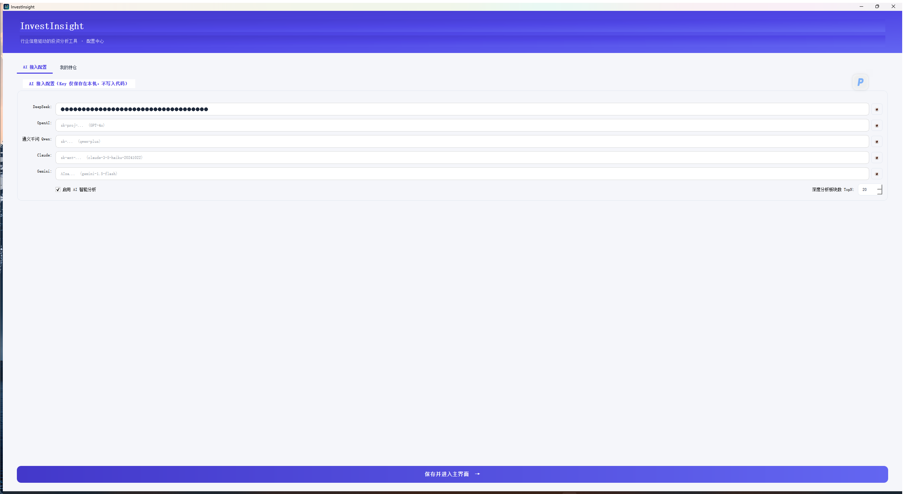

主界面空态：

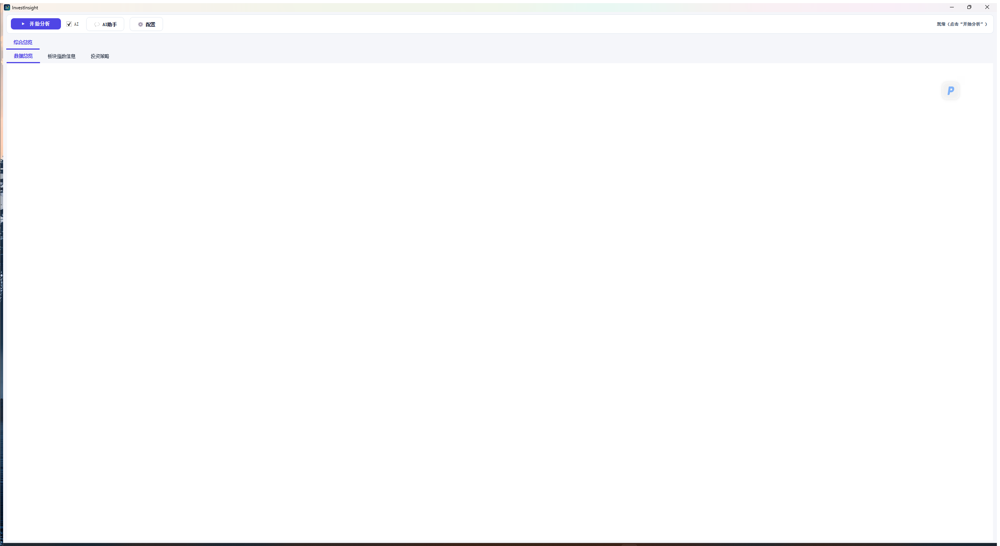

真实分析后的当前总览参考：

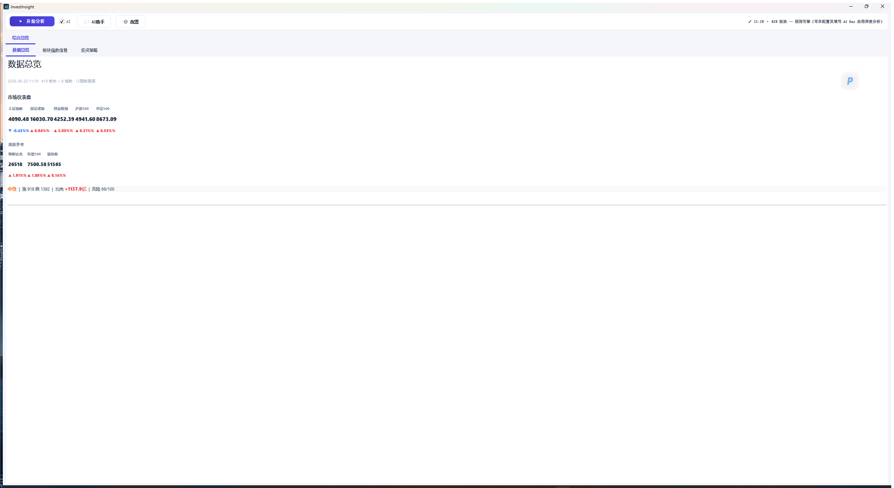

用户补充的当前板块详情长截图参考：

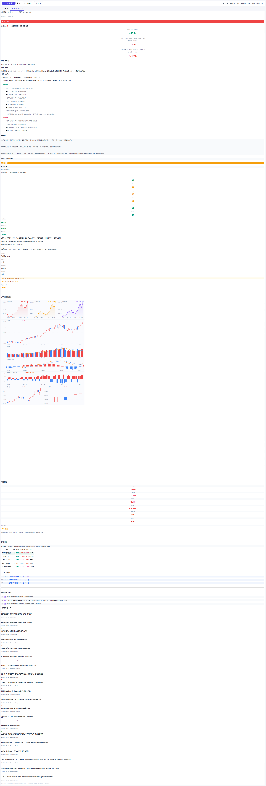

## 优化后的主界面设计稿

PNG 预览：

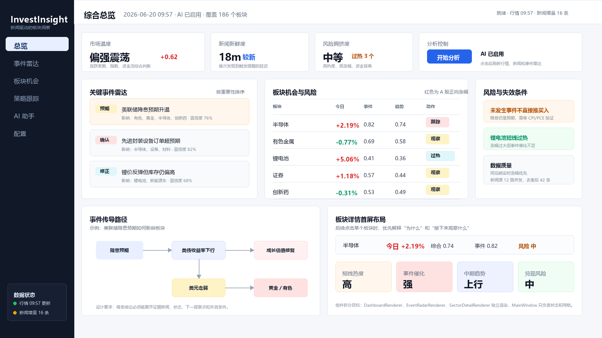

可编辑 SVG 源稿：

[assets/investinsight-ui-redesign-dashboard.svg](assets/investinsight-ui-redesign-dashboard.svg)

PNG 生成脚本：

[render_investinsight_ui_mockup.py](render_investinsight_ui_mockup.py)

## 其他页面设计稿

事件雷达：

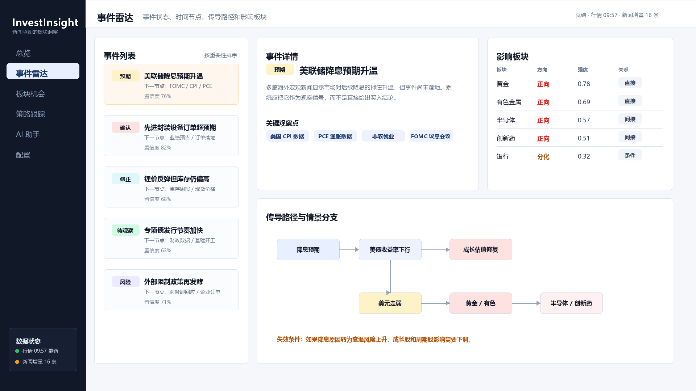

板块机会：

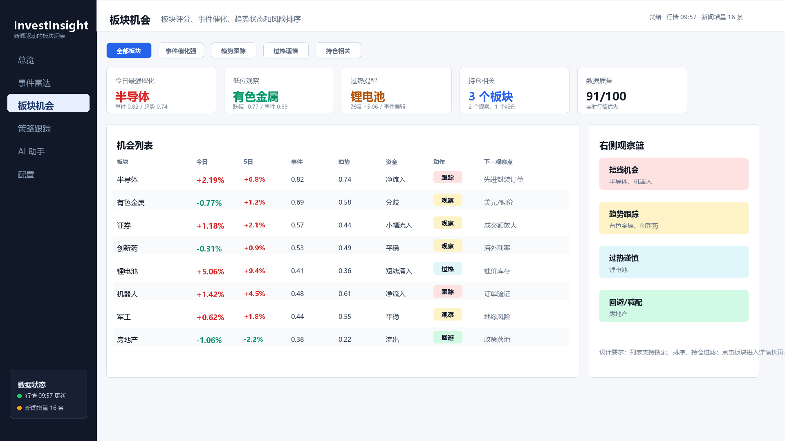

策略跟踪：

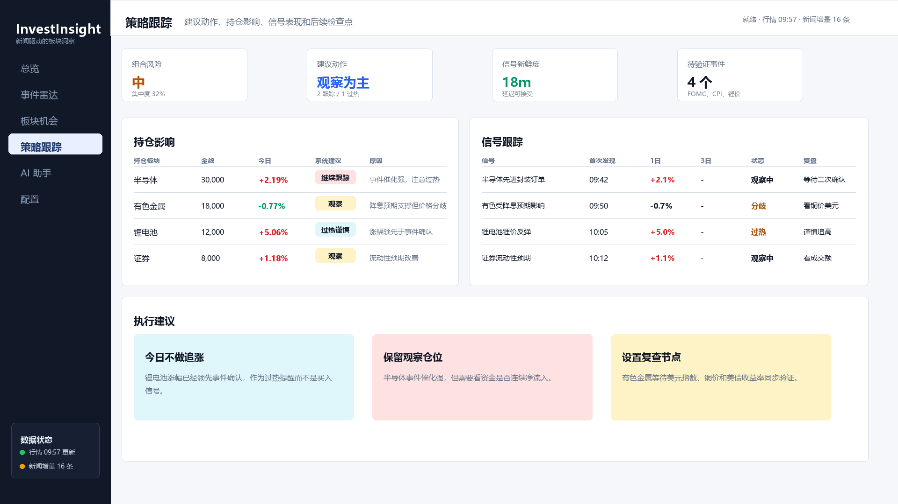

AI 助手：

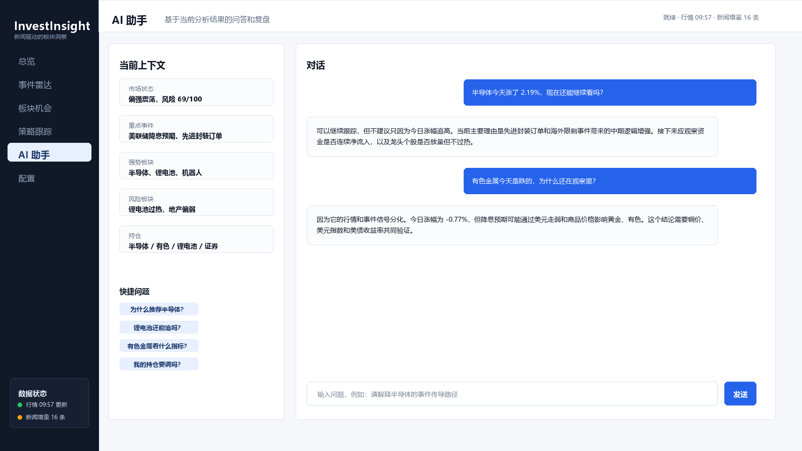

配置：

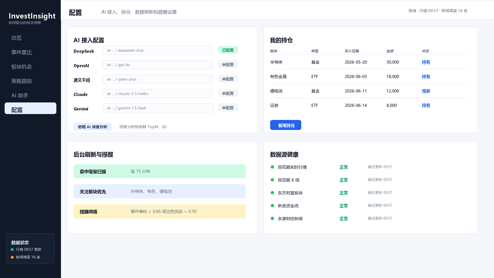

板块详情长图：

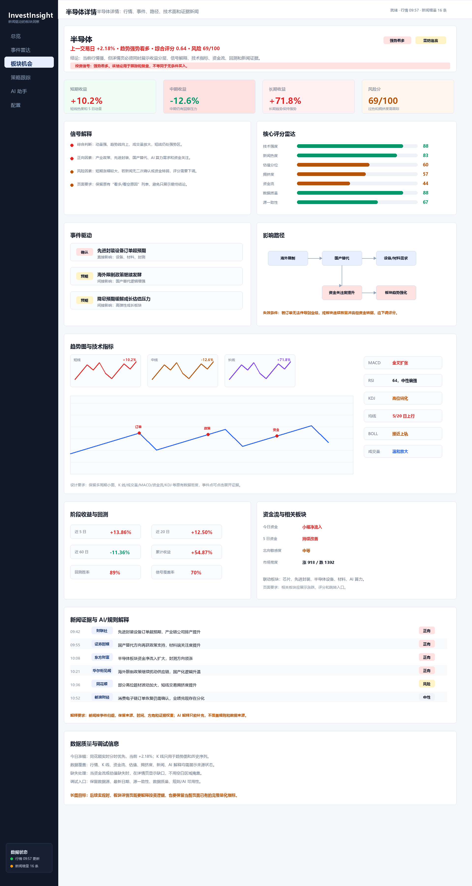

全页面 PNG 生成脚本：

[render_investinsight_ui_mockup_pages.py](render_investinsight_ui_mockup_pages.py)

运行方式：

```powershell
& "C:\Users\oneDayDay\.cache\codex-runtimes\codex-primary-runtime\dependencies\python\python.exe" docs\versions\v2.0\design\render_investinsight_ui_mockup.py
& "C:\Users\oneDayDay\.cache\codex-runtimes\codex-primary-runtime\dependencies\python\python.exe" docs\versions\v2.0\design\render_investinsight_ui_mockup_pages.py
```

## 设计重点

1. 主导航从顶部 Tab 转为左侧功能导航，减少顶部拥挤，并为后续 `事件雷达`、`策略跟踪`、`AI 助手` 留出稳定入口。
2. 第一屏优先回答三个问题：市场现在是什么状态、最重要事件是什么、哪些板块值得观察或需要回避。
3. 总览页不再只堆表格，而是拆成 `市场状态`、`关键事件雷达`、`板块机会与风险`、`风险与失效条件`、`事件传导路径`、`板块详情首屏布局`。
4. 板块今日涨幅沿用 A 股习惯：红色表示上涨或正向涨幅，绿色表示下跌。
5. 未发生事件只作为观察和仓位约束，不在 UI 上直接表达为“买入”。
6. 风险提示与机会提示同级展示，避免软件只强调利好。
7. 板块详情页需要保留当前长页面已有的数据密度，包括短中长期收益、核心评分、信号解释、技术指标、阶段收益/回测、资金流、相关板块、新闻证据和数据质量。

## 后续实现映射

| 设计区域 | 建议实现模块 |
| --- | --- |
| 顶部状态条 | `MainWindow` 或 `MainPageBuilder` |
| 左侧导航 | `MainPageBuilder` |
| 市场状态卡片 | `DashboardRenderer` |
| 关键事件雷达 | `EventRadarRenderer` |
| 板块机会与风险表 | `SectorTableRenderer` |
| 风险与失效条件 | `DashboardRenderer` 或 `EventRadarRenderer` |
| 事件传导路径 | `EventRadarRenderer` |
| 板块详情首屏 | `SectorDetailRenderer` |
| 策略跟踪 | `StrategyRenderer` 或 `StrategyTrackingPanel` |
| AI 助手 | `ChatPanel` |
| 配置和持仓 | `SetupPageBuilder`、`PortfolioPanel` |

## 板块详情页数据要求

板块详情页不能只做成事件解释页。根据当前真实长截图，后续实现时应至少包含：

- 顶部结论：板块名、上一交易日/今日涨幅、趋势判断、综合评分、风险分和投资信号。
- 收益分层：短期收益、中期收益、长期收益和风险分。
- 信号解释：正向因素、风险因素、页面提示和失效条件。
- 核心评分：技术强度、新闻热度、估值分位、拥挤度、资金流、数据质量、源一致性。
- 事件驱动：事件状态、事件标题、直接/间接影响。
- 技术图表：短中长期小图、K 线、成交量、MACD、资金流、KDJ 或等价指标。
- 阶段收益与回测：近 5 日、近 20 日、近 60 日、累计收益、回测胜率、信号覆盖率。
- 资金流与相关板块：资金方向、北向敏感度、市场宽度、联动板块。
- 新闻证据：来源、时间、标题、方向标签，并按事件归组。
- 数据质量：行情口径、K 线来源、缺失项、规则/AI 可用性和调试入口。

## 验收标准

- 1366x768 和 1920x1080 下文字不重叠、不溢出。
- 第一屏能看到最重要的 3 到 5 条事件或板块结论。
- 点击板块详情后，能看到“事件、路径、下一观察点、失效条件”。
- 板块详情长页应包含首屏结论、事件驱动、影响路径、趋势图事件标记、技术面、操作策略、新闻证据和数据质量。
- 板块详情长页不能删减当前已有的重要量化数据，尤其是收益分层、评分雷达、回测/胜率、资金流和多指标图表。
- `MainWindow.cpp` 不再新增大段 HTML 字符串。
- 新增 UI 代码优先进入 renderer 或 panel 文件。
